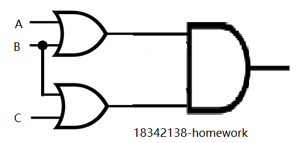
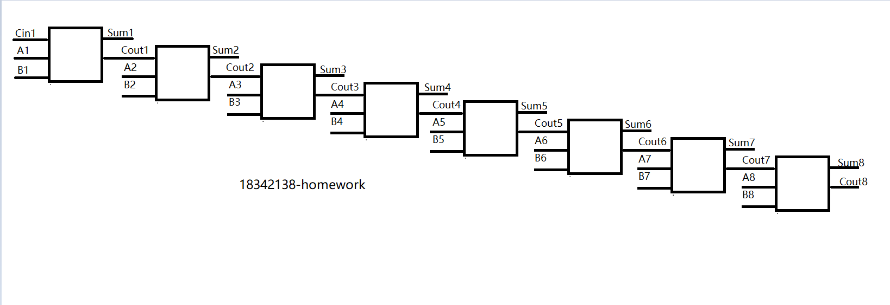

1) Give the three representations of an AND gate and say in your words what AND means.   

     
The output is high (1) only when the input is high (1); if there is at most one high input, the output is low.
   
2) Give the three representations of an XOR gate and say in your words what XOR means.    

     
If the levels of the two inputs are different, the output is high (1); if the levels of the two inputs are the same, the output is low (0).

3) Draw a circuit diagram corresponding to the following Boolean expression: (A + B)(B + C)   

4) Show the behavior of the following circuit with a truth table:   

|A|B|A’|AB|O|
|-|-|-|-|-|
|0|0|1|0|1|    
|0|1|1|0|1|    
|1|0|0|0|0|    
|1|1|0|1|1|    

5) What is circuit equivalence? Use truth table to prove the
following formula.
(AB)’ = A’ + B’

|A|B|AB|(AB)’|A’+B’|
|-|-|-|-|-|
|0|0|0|1|1|
|0|1|0|1|1|
|1|0|0|1|1|
|1|1|1|0|0|    

6) There are eight 1bit full adder integrated circuits. Combine them to 8bit adder
circuit using the following box diagram.

7) Fill the follow expression   

(1) (X8X7X6X5X4X3X2X1)2 or (00001111)2 = (X8X7X6X5(!X4)(!X3)(!X2)(!X1))2

(2) (X8X7X6X5X4X3X2X1)2 xor (00001111)2 = (X8X7X6X5(!X4)(!X3)(!X2)(!X1))2

(3) ((X8X7X6X5X4X3X2X1)2 and (11110000)2 ) or (not (X8X7X6X5X4X3X2X1)2 and (00001111)2) = (X8X7X6X5(!X4)(!X3)(!X2)(!X1))2      
      
使用wiki解释

1)Logic gate：     

Logic gates are the basic components of integrated circuits. Simple logic gates can be made of transistors. The combination of these transistors allows the high and low levels representing the two signals to produce high or low level signals after passing them。

2)Boolean algebra：

Boolean algebra originates from mathematics, and it is a formula for set operations and logical operations.

自学存储电路。维基百科：“Flip-flop”，选择中文：    

1)Flip-flop 中文翻译是？ 触发器     

2)How many bits information does a SR latch store?
锁存器有“4位锁存器”（可以储存四个比特）或“8位锁存器”（可以储存八个比特）等等。

