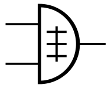

1) Give the three representations of an AND gate and say in your words what AND means.   

     
The output is high (1) only when the input is high (1); if there is at most one high input, the output is low.
   
2) Give the three representations of an XOR gate and say in your words what XOR means.    

     
If the levels of the two inputs are different, the output is high (1); if the levels of the two inputs are the same, the output is low (0).

3) Draw a circuit diagram corresponding to the following Boolean expression: (A + B)(B + C)   

.jpg)

4) Show the behavior of the following circuit with a truth table:   

|A|B|!A|AB|O|
|0|0|1|0|1|
|0|1|1|0|1|
|1|0|0|0|0|
|1|1|0|1|1|
