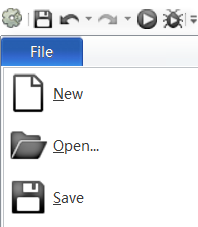
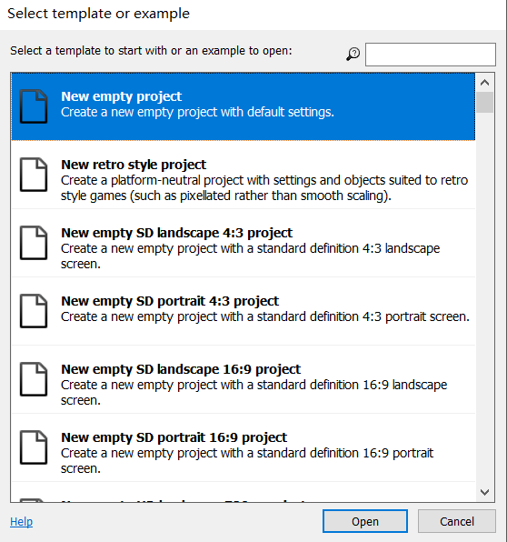
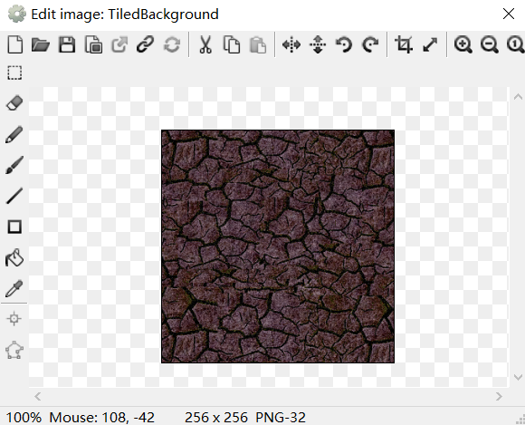
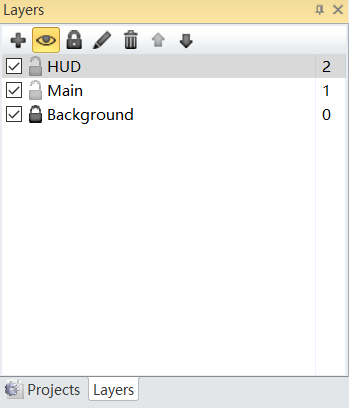
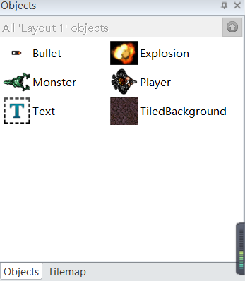
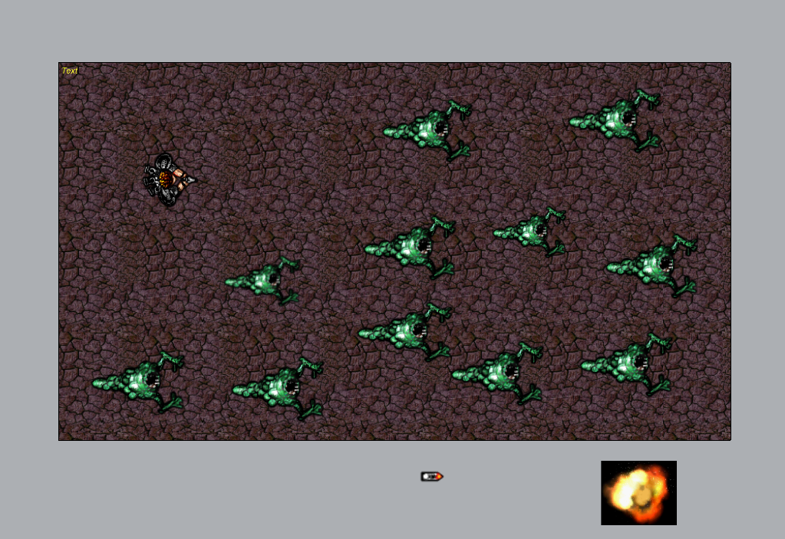
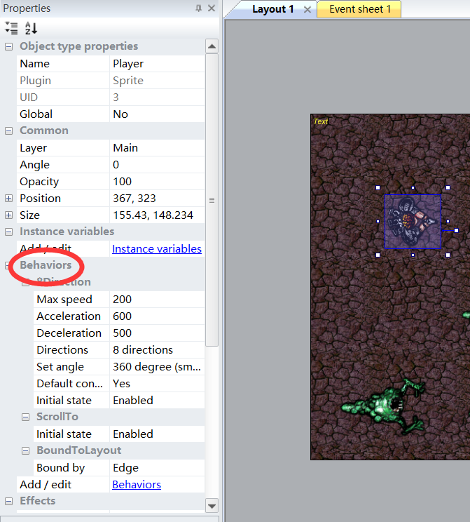
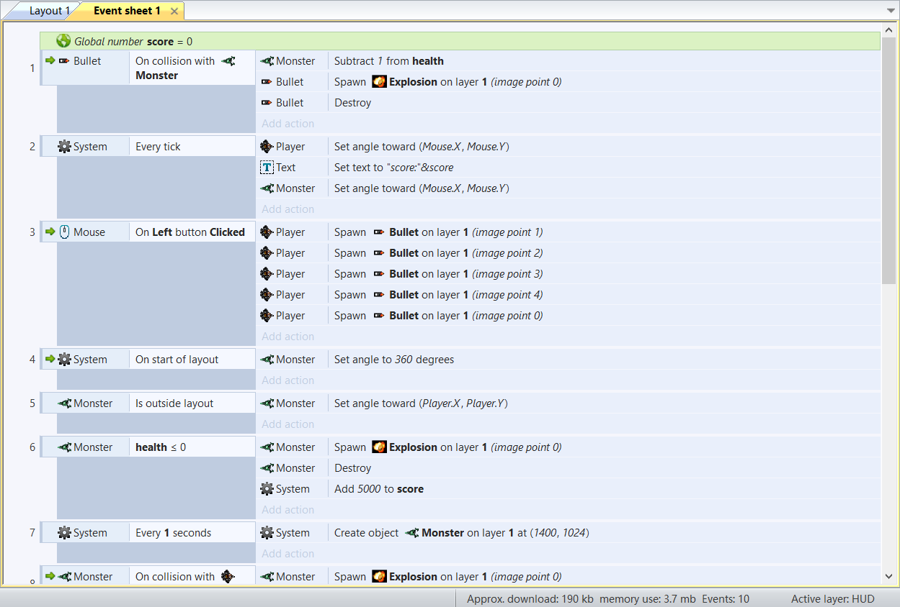
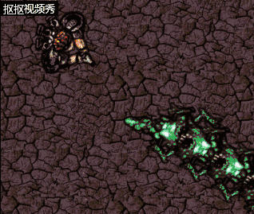

### 记录初学用construct2制作游戏的过程以及几点注意事项   

Construct2给予了我们无需编码便能制造出有趣的HTML5游戏的机会，本篇博文将记录博主学习制作HTML5游戏的过程以及其中遇到几个新手可能同样会碰到的问题。    

首先我们打开construct2软件，点击左上角的file然后点击new，我们便可新建一个新的空白的游戏制作项目。
   

   

接着我们双击空白背景，即可插入我们想要的部件，首先我们要给该游戏添加一个背景图，我们选择Tiled Background，然后加入我们已经下载到本地的背景图。   

   

加入图片之后可以在主面板对背景图进行拉伸以覆盖整个透明面板。    

     

随后我们需要新建一个文件区别于背景层来加入我们游戏中需要的元素，如图，通过左上角的＋号我们可以添加一个文件夹（可重命名位main），随后便可向该层添加元素（即图片）。值得注意的是：同一个元素我们只需添加一个，如有需要，我们可以对其进行复制，他们将拥有相同的行为（action），这将大大减轻了我们对各元素设置行为（behavior）时的负担。   

 

插入完元素之后就是对各元素的行为进行设置，以下将通过behavior进行设置，单击该元素后在左边栏behavior下可添加你所需要的行为。

接着就来到了最关键的一个环节：add event and action   
我们点击layout右边的eventsheet1，容易看到add event 与 add action 两个选项 ，值得注意的是：一个event与action的是有着严格对应的，只有当event发生了之后其右方对应的action才会生效。我们可以通过鼠标拖动或者CTRL+c/v来调整event/action的位置。

最后，添加完所有你需要的功能之后便可通过上方的Run layout 来测试你制作的游戏啦！

