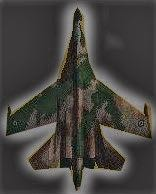
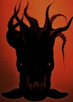

## 使用Construct2制作HTML5游戏（进阶版）   

### 游戏策划（Game planning）:    
#### 楔子（Setting）:   
公元2200年，人类世界与机器世界爆发了一场战争，人类通过发射离子云阻挡了机器人必须的太阳能，由此人类取得了短暂胜利，然而机器人制造了一种名为乌贼的怪物，它可以穿过黑暗，无需太阳能即可攻击人类世界，现在乌贼军团要来了，而且携带着我们人类的人质，世界组织决定派出你驾驶歼-100战斗机前去应战，你的任务是在不伤害到人质的前提下击杀所有乌贼，一定不能让乌贼军团突破进入人类世界的最后一道防线，否则我们都得死亡…………    
#### 玩法（Gameplay）：    
你可以通过键盘左/右键控制飞机的位置，单击鼠标左键可以发射一颗激光弹，乌贼和人质都是被射中一颗子弹就会死亡，击杀一个乌贼得分为5，误伤了所有人质或被乌贼碰撞到战机累计五次或被乌贼冲破了防线，游戏将结束（Game Over）！    
#### 人设与道具（Game Sprites）：   
Player ：  战机拥有五滴血，每被乌贼撞击一次扣除一滴血，血量为零时战机爆炸。    
Enemy ：  乌贼一击必死，但数量众多，且随游戏进行，移动速度加快，它们的目标就是冲破防线，攻击人类世界。    
laser-bomb ：  激光弹威力巨大，对乌贼造成毁灭性打击。   

### 游戏设计（CRC卡片方法） ：   

+———————————————————————————+                   
|Object  Name ：Player（战机)|                 
+—————————————————————————————————+                 
|Attributes : 位于最下方，可左右移动|            
+————————————+—————————————————+           
|Collaborator| Events & Actions|         
+——————+————————————————+         
|nobody|攻击&摧毁或被摧毁|        
+——————+————————————————+         
      
      
+—————————————————————————————————————+           
|  Object  Name ：乌贼                 |         
+—————————————————————————————————————+         
| Attributes ： 从天而降，攻击地球      |       
+————————————————+————————————————————+         
| Collaborator   | Events & Actions   |         
+————————————————+————————————————————+         
|    其他乌贼     |   摧毁战机&被击杀   |        
+————————————————+————————————————————+               
      
      
### 编程 ：    
     

### Gif效果动画展示 ：     
   

+---------------------------------+  
| Object Name                     |  
+---------------------------------+
| Attributes                      |
+--------------+------------------+
| Collaborator | Events & Actions |
+--------------+------------------+
|              |                  |
+--------------+------------------+
