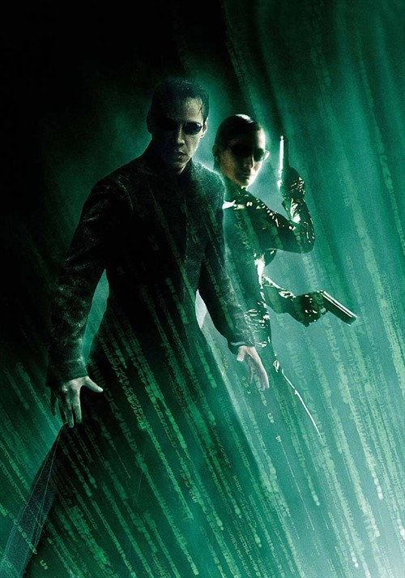
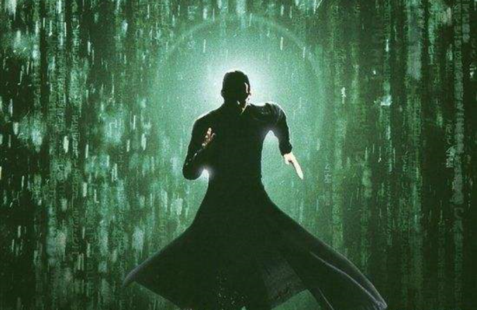
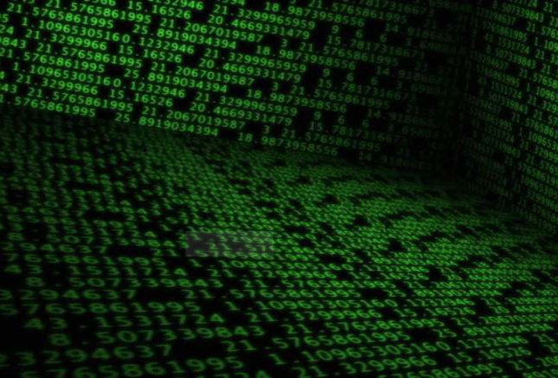

## it电影推荐————《黑客帝国》   

本篇博文将向大家推荐一部it类电影，通过该电影我们可以对it与人类产生更抽象更奇妙的想法与思考。    

事不宜迟，我们开始吧！   

该电影系列为：黑客帝国，其中包含三部：黑客帝国1；黑客帝国2（重装上阵）；黑客帝国3（矩阵革命）；   

   

##### 故事的情节大概为：     
在2200年，人类与机器发生了一场战争，最终人类为了消除机器所必须的太阳能而制造了离子云遮蔽了天空，然而机器并未因此失败，他们制造出了更为强大的乌贼军团，并通过各式各样的技术手段控制住人类世界。其中机器为了使用人类的生物电，将人类的大脑接入一个叫 Matrix 的地方，以此来保持人类大脑的活动。但是 Matrix 里的毕竟是人类，通过观察和思考总有觉醒者，他们知道自己生活的世界是不真实的。于是设计师就让这些人从培养槽里出来，生活在真正的世界里，防止他们在 Matrix 里影响其其他人类的思想。每隔一段时间，Matrix 的系统都会出现很多错误和异常，系统会自动把这些错误和异常的信息和代码赋予到一个人身上，这个人就是 the One，然后由 Oracle（先知）通过散播一个谎言（预言）引诱the One回到电脑主机，最后以毁灭全人类为威胁，要求the One交出代码和信息，升级系统。但是由于 Oracle 研究人性的时间长了，对人类产生了同情，于是就在这第六次 the One 出现的时候希望避免 Zion 的毁灭。Oracle 采用了爱情策略，诱使 Neo 没有进入电脑主机。最后 Neo 以消灭病毒程序 Smith 的疯狂繁殖为条件，换取了和平，成功的拯救了 Zion 人民。     

    

###### 从这套电影系列中，我们可以对人类世界与机器世界有更深入的了解与更丰富的想象，也许通过这三部电影我们会有对过往一些陈旧的想法提出质疑，或冒出对未来更新奇的想法，相信大家在观看这套it电影系列中能够享受在人类的真实世界与机器的虚拟世界之间穿梭来回的快感，一边观看一边思考那些永无答案的问题：我们是否又生活在别人制造的计算机虚拟世界中呢？我们会不会只是别人电脑中的一个程序？甚至一行代码？我们所经历的一切会不会只是一套程序设定？

