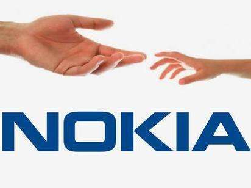
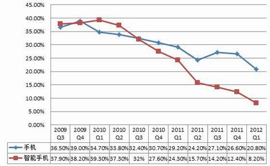
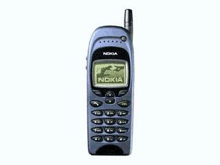

### 诺基亚由盛转衰背后的诺威格定律与基因决定定律    

当被问到当今流行手机品牌由那些时候，大部分人都会回答“苹果”“华为”“小米”等等 ，但是当被问到十年或者二十年前的流行手机时候，大家都会想到诺基亚这个手机品牌，然而为什么短短的十年中诺基亚帝国瞬间从人们的眼中消失，其实这背后蕴藏着it领域的两大定律：诺威格定律、基因决定定律。今天我们就来探讨一下诺基亚由盛转衰背后的那两大it定律吧！

#### 首先，我们先了解一下这两大定律的内容：    
诺威格定理是指“当公司的市场占有率>50% ，市场占有率无法再翻番了”。      
基因决定定律是指一家公司进入新业务的最大壁垒来自内部运营。   

时间回到1995年，诺基亚公司的整体手机销量和订单剧增，公司利润大增。到了1996年诺基亚手机已经连续15年占据手机市场份额第一的位置。到了1998年诺基亚成功超越摩托罗拉成为全球最大的手机生产商。到了2003年，诺基亚1100在全球已累计销售2亿台。然而到了2007年，苹果携iPhone杀入智能手机市场，给诺基亚带来了致命的威胁。后来，诺基亚在手机领域的地位逐渐被苹果、三星等公司超越。最后诺基亚帝国彻底破灭，并被微软收购。    

在这里我们可以看到这一切的背后诺威格定律的存在，当年的诺基亚占据着超过50%的市场份额，当然超过了50%还怎么能翻番呢，但是诺威格定律的含义岂止是说一个鼎盛的公司在占领市场超过一半的份额后无法达到更高或者占据整个市场的境界，更加重要的内涵是，这样的一个鼎盛公司其实随时可能面临着在短时间内走向灭亡的困境。  

诺基亚就是诺威格定律其中的一个典型的例子，当已经占据了过半的市场份额的时候，它不知道如何能够继续提高或者保持住自己的霸主地位，或者它尝试过通过扩张新领域来继续提高市场份额但是它因为某种原因失败了。

上面我们提到诺基亚走向失败的原因是它无法进一步提升甚至只是保持住自己的地位，而这其中的原因就要归结到基因决定定律了。

我们先来了解一个小趣闻：早在苹果开始研发智能手机系统之前，诺基亚内部就已经提出了类似的创意，但是诺基亚高层认为，自己所拥有的塞班系统已经足够优秀，于是否决了这个创意。

为什么诺基亚会拒绝在这个创意里面继续前进，这难道不就能成为诺基亚继续领先全球的一个驱动吗？其实这都是因为诺基亚没有摆脱基因决定定律。

从基因决定定律的内容来看，当一个公司开发新业务或者扩张新领域的时候最大的阻力来自与内部自己，这个阻力到底是什么？其实就是原有的传统思想，原有的发展理念，面对一个全新的事物，诺基亚公司是抱着以前的旧理念来看待它的，自然诺基亚最终一定会拒绝这个创新而继续发展自己的传统产业，这样一来诺基亚变得越来越不能满足消费者的需求，自然也不会再有人愿意购买老套的旧时代手机。   

这样一来，我们似乎看到如果当年的诺基亚公司能够摆脱基因决定定律的束缚，它现在或许仍然是世界手机市场的霸主，但现实已经无法改变，我们只有从别人的失败中吸取教训，不要让悲剧发生在自己头上。

