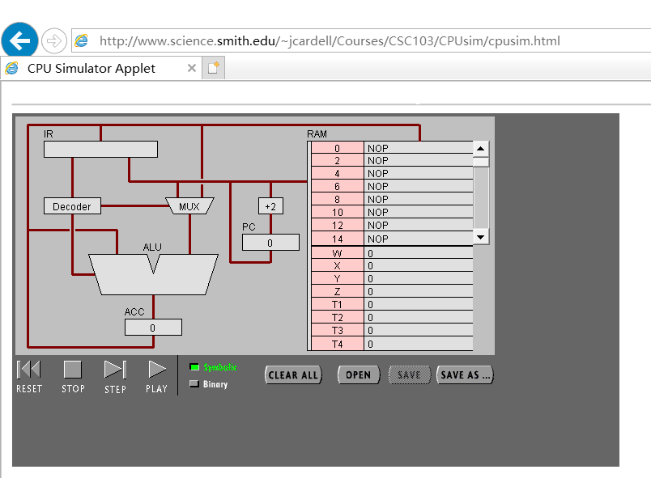
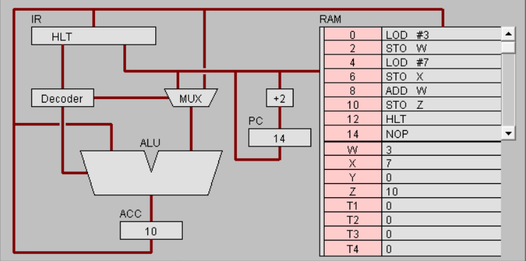
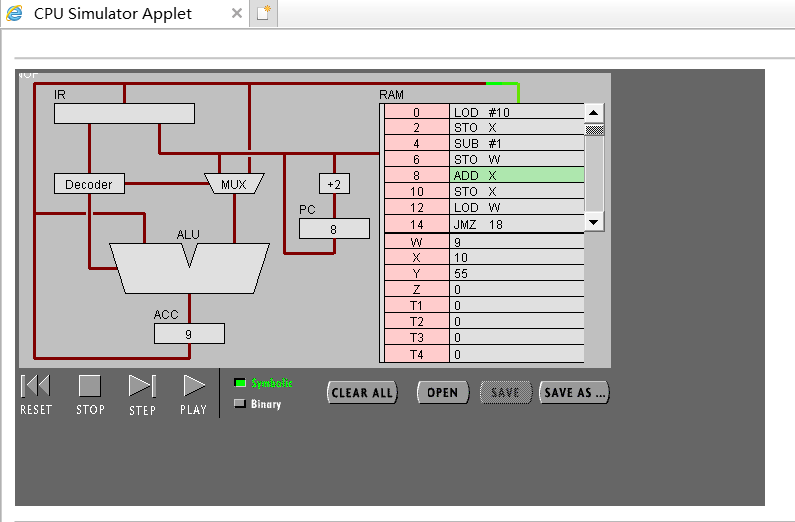

### 硬件编程–机器指令编程——实验报告

#### 实验名称： 硬件编程与机器指令编程学习      
#### 姓名： 郑卓民      
#### 学号：18342138      

### 目录：   
* [1.实验目标](#1)    

* [2.实验步骤与结果](#2)    

* [3.实验小结](#3)    

<h3 id="1">1.实验目标</h3>

1.理解冯·诺伊曼计算机的结构       
2.理解机器指令的构成       
3.理解机器指令执行周期        
4.用汇编编写简单程序       

<h3 id="2">2.实验步骤与结果</h3>

#### 实验准备：

      

#### 任务一：简单程序：

    

观察并回答下面问题：      
PC，IR 寄存器的作用。       
PC是程序计数器，是用来计数的，指示指令在存储器的存放位置，也就是个地址信息。   
IR是指令寄存器，是用来存放指令的，存放当前正在执行的指令，包括指令的操作码，地址码，地址信息。

ACC 寄存器的全称与作用。    
ACC全称为Accumulator，是一个具有特殊用途的二进制8位寄存器，专门用来存放操作数或运算结果。在CPU执行某种运算前，两个操作数中的一个通常应放在累加器中，运算完成后累加器中便可得到运算结果。     

用“LOD #3”指令的执行过程，解释Fetch-Execute周期。         
首先， PC根据地址从RAM中取出指令LOD #3      
接着， 指令传入IR，然后， 指令传入Decoder， 数字3传入MUX      
最后， 数字3传入ALU， 之后传入ACC     

用“ADD W” 指令的执行过程，解释Fetch-Execute周期。       
首先， PC根据地址从RAM取出指令ADD W 
接着， 指令传入IR， 然后， 指令传入Decoder 
接着， ALU从ACC中取值 
接着， IR再次访问RAM中的W，从W中取值 
接着， W的值读入ALU    
接着， ALU执行加法
最后， 结果传入ACC

“LOD #3” 与 “ADD W” 指令的执行在Fetch-Execute周期级别，有什么不同。     
LOD #3 访问RAM一次        
ADD W 访问两次RAM     

写出指令 “LOD #7” 的二进制形式，按指令结构，解释每部分的含义。    
00010100(步骤) 00000111(操作数)

解释 RAM 的地址。     
RAM的地址只能用于暂时存放一些程序和数据，电源关闭或断电时，该地址中的程序和数据就会丢失。    

该机器CPU是几位的？（按累加器的位数）      
16位     

写出该程序对应的 C语言表达。     
int w = 3;      
int x = 7;    
int z = x + w;    

#### 任务 2：简单循环

    

输入程序Program 2，运行并回答问题：

用一句话总结程序的功能:   使X从10开始不断减1直到小于0. 

写出对应的 c 语言程序 ：    
int x = 10;      
while(x >= 0){      
x--;      
}   

修改该程序，用机器语言实现 10+9+8+..1 ，输出结果存放于内存 Y:      
写出 c 语言的计算过程      
int x = 10, w = 0;   
while(x > 0){
 w += x;      
 x--;     
 }    
 

写出机器语言的计算过程     
0000000 00010100 00001010   
0000010 00000101 10000001   
0000100 00010001 00000001   
0000110 00000101 10000000   
0001000 00000000 10000001     
0001010 00000101 10000000   
0001100 00000100 10000000    
0001110 00001101 00010010   
0010000 00001100 00000100   
0010010 00000101 10000010   
0010100 00001111 00000000   
0010110 00001110 00000000   
1000000 00000011   
1000001 00000111   
1000010 00001010    
1000011 00000000    

用自己的语言，简单总结高级语言与机器语言的区别与联系。       
区别： 机器语言是计算机直接能够接受和应用的语言 是二进制的编程语言 对人来说十分难懂与难编写。而高级语言是人类后来为了编写程序更加高效简单而发明出来的语言，计算机不能直接接受高级语言。   
联系： 高级语言通过编译可以转化位机器语言使计算机能够接受人类的命令。     

<h3 id="3">3.实验小结</h3>    

通过实验，理解了机器指令的构造以及其运行周期的定义，并且对计算机cpu接受机器语言执行任务有了更形象的理解。    
除此之外，还学会了如何用机器语言编写程序以及机器语言与高级语言之间的转换。
