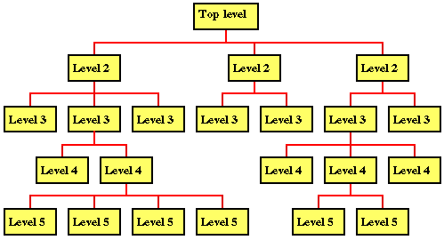

## 自顶向下 逐步求精

**“自顶向下 逐步求精”** 的编程方法又称为Top-Down Design， 我们可以从维基百科上了解到它的定义为“ Top–down design is focused on high-level functional requirements, with relatively less focus on existing implementation technology. ”			

#### 其实，这种编程思想就是：	

• Breaking the problem into a set of subproblems called modules	

• Creating a hierarchical structure of problems and subproblems (modules)	

先**自顶向下**分析将大问题分解为几个小问题				

然后针对每一部分进行**逐步求精**，完善细节	



#### 下面我们以洗衣机为例用“自顶向下 逐步求精”的编程思想对洗衣机的程序设计进行分析：		

我们通过对洗衣机的运行过程进行**分析**，可以得到洗衣机进行的一些**基本操作**：	
			
water_in_switch(open_close) // open 打开上水开关，close关闭   

water_out_switch(open_close) // open 打开排水开关，close关闭		 

get_water_volume() //返回洗衣机内部水的高度		         

motor_run(direction) // 电机转动。left左转，right右转，stop停			

time_counter() // 返回当前时间计数，以秒为单位				          

halt(returncode) //停机，success 成功 failure 失败				        

以上就是我们通过  **自顶向下**  将洗衣机运行过程分为的几个部分				
接着我们尝试使用**伪代码**去分解洗衣机运行过程中的大步骤：			

```
//正常洗衣流程
选择 洗衣模式 水量 时间
打开上水开关 
	返回洗衣机内部水量到达预定高度 
关闭上水开关
浸泡规定时间
漂洗两次
	打开电机 电机转动 左转两圈 右转两圈 停止
	计数器返回当前漂洗时间
	到达指定时间后 关闭电机
打开排水开关
	返回内部水量 到达0
脱水规定时间
	打开电机 电机转动 左转十圈 右转十圈 停止
	计数器返回当前脱水时间
	到达指定时间后 关闭电机
关闭排水开关
停机 返回成功
```	

这样一来我们已经得到洗衣机程序中的一些大模块的信息，							
接下来我们要做的就是对这些大模块进行完善细节，**逐步求精**。				

这里我们使用更加完善的伪代码来实现我们的洗衣机算法的程序：			
（其中我们实现的是正常洗衣的流程）

```cpp
//正常洗衣流程
READ(Washmode, Vwater, WashTime) 

WHILE get_water_volume() < Vwater
	water_in_switch(open)
END WHILE

water_in_switch(close)

SET now = time_counter()
WHILE time_counter() <= now + 300s
END WHILE

SET now = time_counter() //漂洗第一次过程
WHILE time_counter() <= now + WashTime
	motor_run(left)
	motor_run(left)
	motor_run(right)
	motor_run(right)
END WHILE

WHILE get_water_volume > 0
	water_out_switch(open)
END WHILE

water_out_switch(close)

WHILE get_water_volume() < Vwater //漂洗第二次过程
	water_in_switch(open)
END WHILE

water_in_switch(close)

SET now = time_counter() 
WHILE time_counter() <= now + WashTime
	motor_run(left)
	motor_run(left)
	motor_run(right)
	motor_run(right)
END WHILE

WHILE get_water_volume > 0
	water_out_switch(open)
END WHILE

SET now = time_counter()
WHILE time_counter()  <= now + 600s
	SET Lcount = 1
	IF Lcount <= 10
		motor_run(left)
	END IF
	SET Rcount = 1
	IF Rcount <= 10
		motor_run(right)
	END IF
END WHILE

water_out_switch(close)

halt(success)
```

通过以上**更为完善的伪代码**的编写，我们对于洗衣机算法的细节进行了进一步的完善。				
为了**进一步求精/追求细节的完美/追求程序的可读性**，我们可以对我们的伪代码进行进一步的优化，例如我们将一些常用的**子步骤**编写为一个块，当我们需要执行该子步骤时候 ，我们可以对块直接调用，这样使得我们的程序更加**简洁**，更具**可读性**，也让后续的修改更加**便捷**。		

其中我们可以对“时间等待”“注水”“排水”这三个子程序进行归块设计：			

```cpp
//wait(time)
FUNCTION wait(time)
	SET now = time_counter()
	WHILE time_counter() >= now + WashTime
	END WHILE
END FUNCTION 

//注水(volume, timeout)
FUNCTION put_in_water(volume, timeout)
	SET now = time_counter
	WHILE get_water_volume() <= volume
		water_in_switch(open)
		IF time_counter >= now + timeout THEN
			halt(failure)
		END IF
	END WHILE
	water_in_switch(close)
END FUNCTION

//排水（timeout）
FUNCTION put_out_water(timeout)
	SET now = time_counter()
	WHILE get_water_volume() > 0
		water_out_switch(open)
		IF time_counter >= now + timeout THEN
			halt(failure)
		END IF
	END WHILE
	water_out_switch(close)
END FUNCTION
```

由此，我们后续无论对源代码进行各种功能丰富的修改，当我们需要其中某个子步骤时候，哦我们只需要调用该模块，而不用再重新编写相同的程序，一来提高了**效率**，二来增加了可读性。

这样一来，我们可谓是对该洗衣机算法进行了**逐步求精**的过程，使得该算法的细节部分更加完善。

通过对洗衣机算法的分析过程，我相信大家对**“自顶向下 逐步求精”**这一编程思想有了更深的理解，以后在我们的编程之路上，我们也应深入贯彻这一思想。
