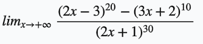
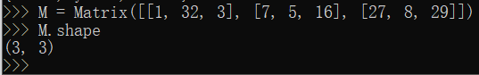

## python编程语言实验报告			

#### 实验名称： 用python做计算器，做数学题			

#### 姓名：郑卓民

#### 学号：18342138

### 目录：			
* [1.实验目的](#1)

* [2.实验步骤与结果](#2)

* [3.实验小结](#3)

<h3 id="1">1.实验目标：</h3>				

1、了解一种“解释型”语言 python

2、使用 python 做一些简单的科学计算

3、使用python求解高数题目

4、使用python求解线代题目

<h3 id="2">2.实验步骤与结果</h3>				

##### 实验准备：

环境准备：		
 	

基本操作学习：

	

##### 实验一：				
##### 使用python求解高数题目：	

首先，导入math库和sympy库。

高数题目一：		

求解 

高数题目二：

求解 e^x 的泰勒展开：

##### 实验二：				
##### 使用python求解线代题目：

线代题目一：

求解方程组：

线代题目二：

对该矩阵进行以下操作：

		
1、获取矩阵的行列：

2、求逆矩阵：

3、求转置矩阵

<h3 id="3">3.实验小结</h3>    
通过本次运用python做数学题的实验，我不仅学会了如何运用python对高数与线代一些难以通过搜索引擎搜出答案的题目进行求解，同时学会了如何使用markdown编辑各种数学公式。此次实验收获匪浅。

