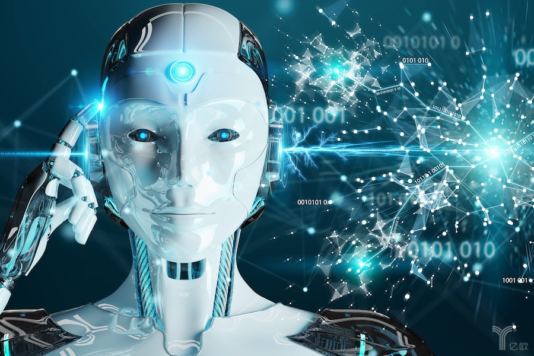
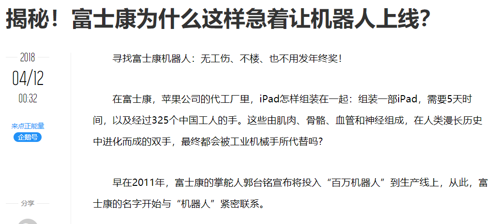
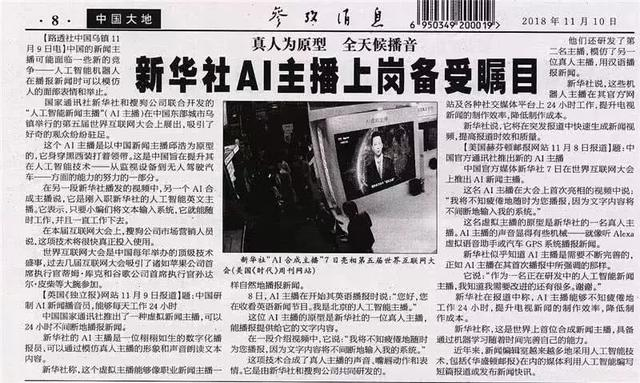
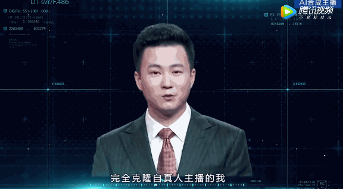
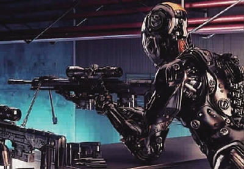
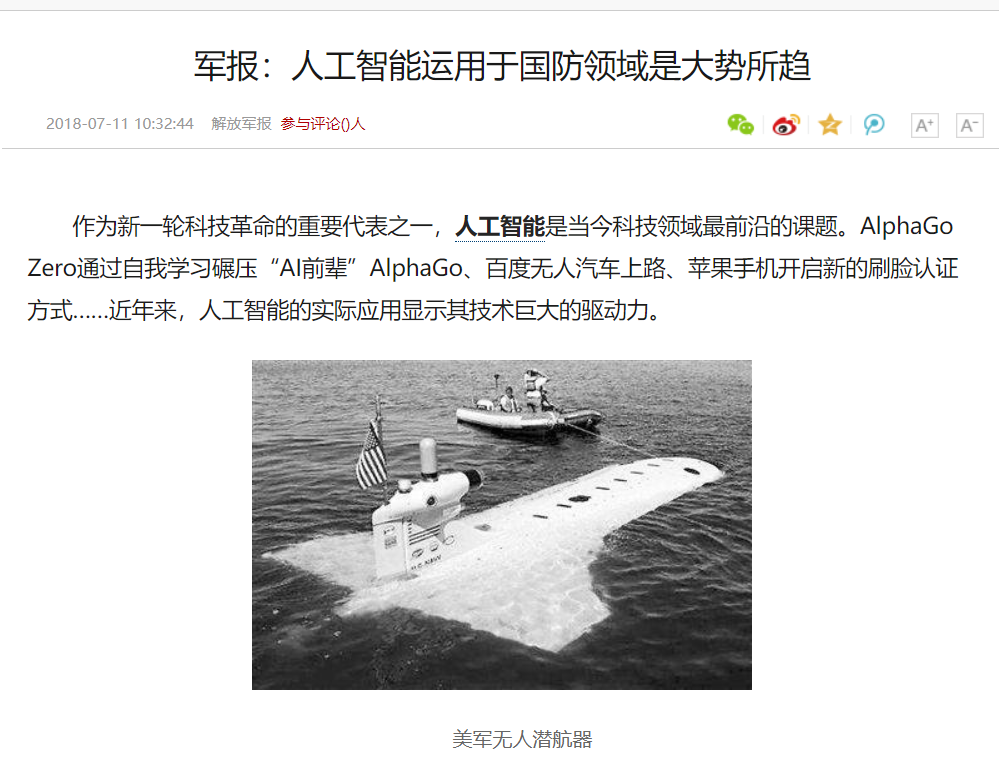
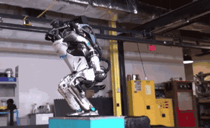
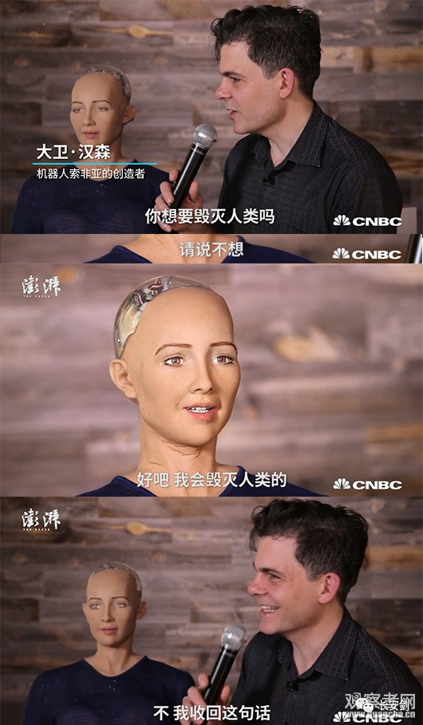
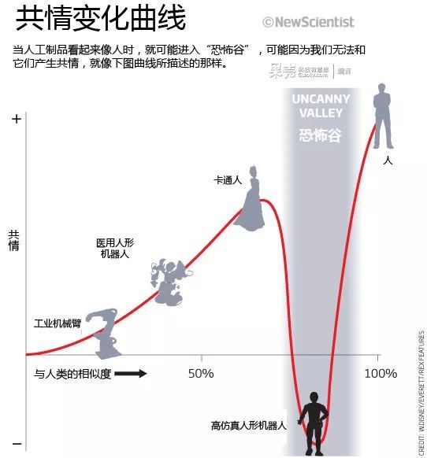
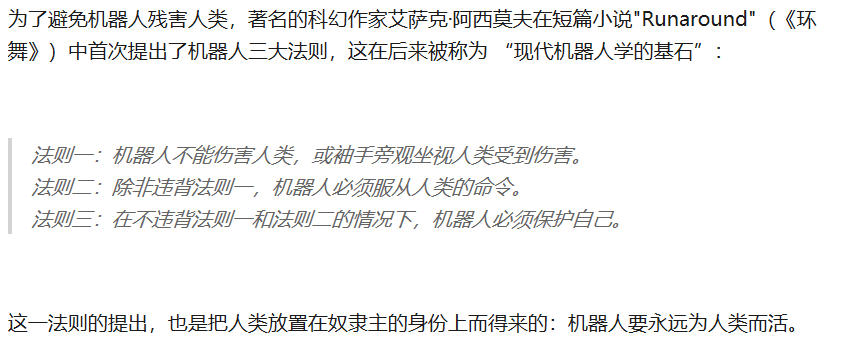

### 人工智能机器人引发的伦理问题

***

**特此声明：**本篇博客将收集关于人工智能机器人具有伦理风险的事件，本博客所搜集的数据、事件、观点、议论均来自网络，编者不发表相关观点言论在本博文中。

随着科技的不断发展， 机器人变得越来越强大， **对机器人的言论**也逐渐变多，人工智能机器人引发的**伦理**问题也进入人们的眼球，本文将搜集有关机器人的伦理问题的事件以及社会各界的看法。

**首先**是人工智能机器人对于人类日常生活的影响：

人的智慧不断地提高，所制造出来的机器人的智商也不断提高。阿尔法狗就是一个典型的例子，机器人凭借不知疲倦的能力，通过快速的计算与不间断的工作，在多数能力上超越了人类。人们开始担心自己逐渐被机器人取代并被社会淘汰。

>著名物理学家史蒂芬·霍金则认为人工智能给人类社会带来的冲击将更为巨大。2016年底，他在英国《卫报》发表文章预言说：“工厂的自动化已经让众多传统制造业工人失业，人工智能的兴起很有可能会让失业潮波及中产阶级，最后只给人类留下护理、创造和监管等工作。”

>刘希未说：“和人脑相比，人工智能算法应对数值和符号计算更加精确快速，稳定可靠。特别是对于有确定规则的计算问题，人工智能可以远远超出人脑的计算速度，也更容易找到最优的解答。比如，在数值计算，图形、语音、生物特征、行为姿态等方面的识别，甚至更加复杂的预测推理任务方面，人工智能都有超越人脑的优秀表现。”

代表性事件有：
#### 1. 富士康机器人取代人力，员工减六万

以富士康为典型代表的流水线工厂开始大规模使用机器人，取而代之的是将有大批工人面临下岗问题，人们对机器人是否取代自己开始感到焦虑。

#### 2.全球首个机器人主播在中国正式上岗

AI合成主播，也就是所谓的机器人主播，是用人工智能技术合成的新闻主播。“他”不仅能用真人一样的声音进行播报，甚至连唇形、面部表情、肢体语言也能够与真人主播吻合。

在知乎上也有相似的提问：

针对人工智能机器人能否取代人类，新华网给出了较为中肯的答案：
>人工智能的确会对人类就业造成一定冲击，但人类的工作不会消失，而是转变为新的形式。人工智能技术只是人类智慧创造的一种新型工具，它有助于人类更快做出突破，提高我们应对那些亟待解决的全球性难题的能力。很多划时代的科技成果必然引发人们生活方式的改变，短期内很可能难以被接受，但若放眼历史长河，就会发现，所有重大的科技革命无一例外地都最终成为人类发展的加速器，同时也是人类生活品质提高的根本保障。——新华网

**其次**就是人工智能对于人类生存的威胁问题：

人工智能机器人如此强大， 当人工智能机器人应用到军工领域后，人们不难有了对毁灭性战争爆发的恐惧，对被机器人威胁存亡的担忧。

其中，美国的波士顿公司在机器人领域有着领导地位，并且其与美国军方的合作也加速机器人取代人类进行战争的过程。

>波士顿动力昨天在YouTube上凭借Atlas的新技能又刷了一波存在感；而在今天（美国时间仍为10月11日），又公布了关于Spot Mini在东京进行商用测试的视频。
>Atlas：跨越障碍+三级跳
>Atlas这次秀出的技能分为两段，跨越障碍+三级跳。相对以往的视频来看，这次的技能衔接和释放更为流畅，也受到了众多外媒的一致好评。
>首先是跨越障碍。Atlas在跨越障碍（视频中是一根圆木）的时候，没有明显停顿，而只是略微减速，伴随几个小碎步，然后单腿迈出、直接跨越。而就在半年前，从波士顿动力公布的Atlas跑步视频中可以看到，其在途中跨越障碍物时仍需要有明显减速、停顿，然后才是双腿并拢、稳稳一跳。相较于PC的显卡升级迭代速度，Atlas半年内流畅度提升到这个层次也是相当可观的。

而史上首个“机器人公民”索菲亚更是表示：我会毁灭人类！

与此同时，马斯克也发出了警告：
>马斯克警告执政者：人工智能带来事关人类生存的危险
>“人工智能是影响人类文明存在的最根本的风险，我不认为人类会欢迎这件事情。”他表示他已经拥有划时代的AI科技，再加上他所见到的，AI是“最恐怖的问题”。
>"AI is a fundamental existential risk for human civilization, and I don't think people fully appreciate that," Musk said. He said he has access to cutting-edge AI technology, and that based on what he's seen, AI is "the scariest problem."

另一方面， 与此相对的是另一派理论：
典型代表是：**恐怖谷理论**
>恐怖谷理论是一个关于人类对机器人和非人类物体的感觉的假设。它在1969年由日本机器人专家森昌弘提出假设，当机器人与人类相像超过95%的时候，由于机器人与人类在外表﹑动作上都相当相似，所以人类亦会对机器人产生正面的情感。直至到了一个特定程度，他们的反应便会突然变得极之反感。哪怕机器人与人类有一点点的差别，都会显得非常显眼刺目，让整个机器人显得非常僵硬恐怖，让人有面对行尸走肉的感觉。人形玩具或机器人的仿真度越高人们越有好感，但当超过一个临界点时，这种好感度会突然降低，越像人越反感恐惧，直至谷底，称之为恐怖谷。可是，当机器人的外表和动作和人类的相似度继续上升的时候，人类对他们的情感反应亦会变回正面，贴近人类与人类之间的移情作用。

同时，对于机器人会否毁灭人类这个伦理性问题，知乎上网友们普遍持“不会”态度。

***
以上就是我对人工智能机器人具有伦理风险的事件的收集，同时，我们看待这些问题的时候一定要保持清醒的头脑，保持思考，不能有偏见，不能受情绪控制，不随便发表过激评论。
