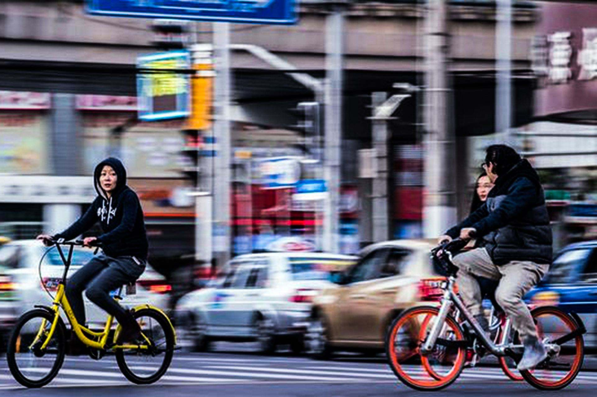
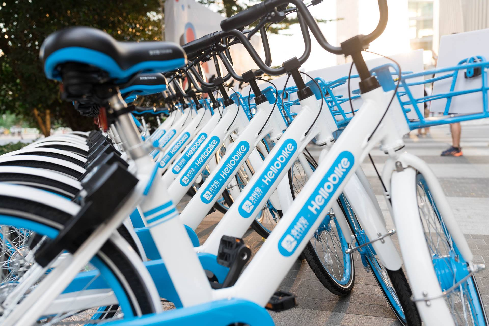
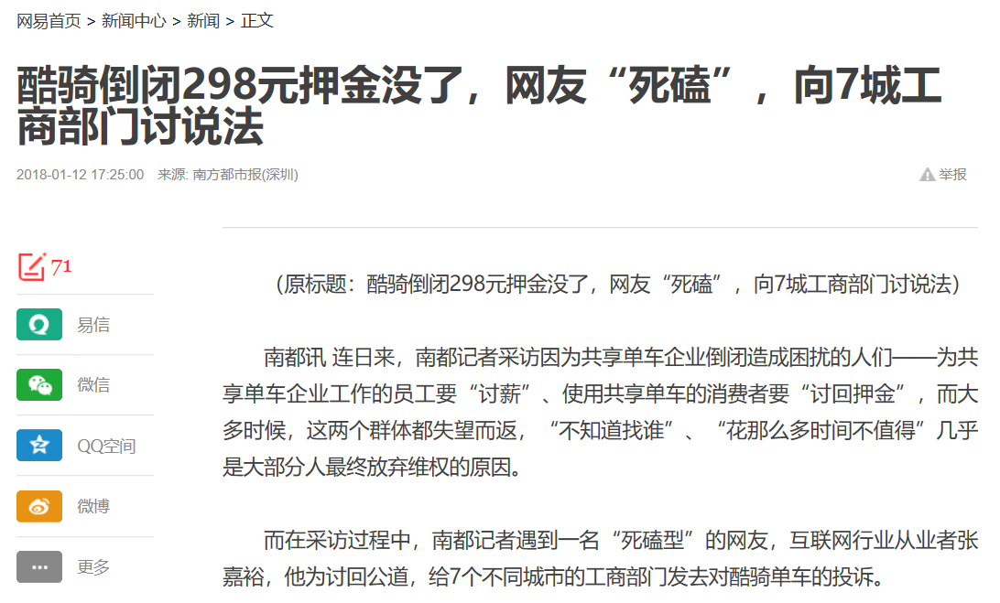
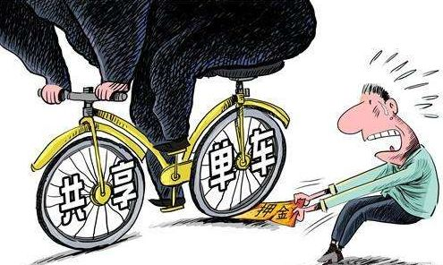
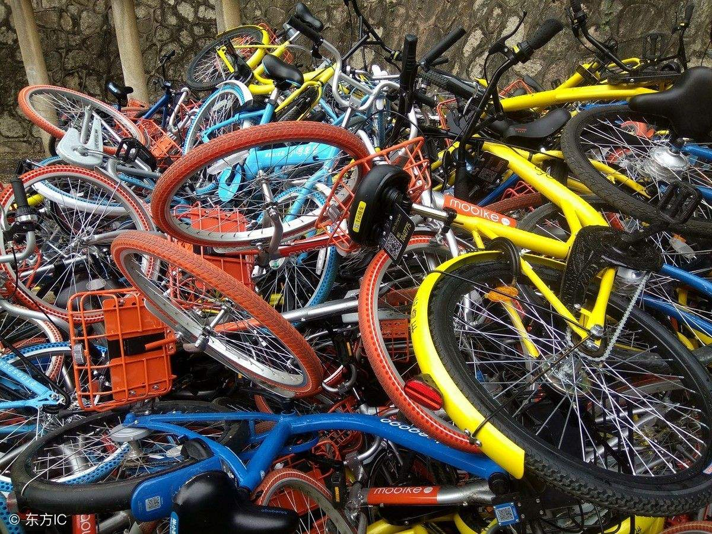

### 共享单车行业的伦理风险事件搜集

**特此声明：**本篇博客将收集关于共享单车行业具有伦理风险的行为，本博客所搜集的数据、事件、观点、议论均来自网络，编者不发表相关观点言论在本博文中。

共享单车可谓近年来的新兴事物，从出现到繁盛只用了不过几年时间：
> 2014年，北大毕业生戴威、薛鼎、张巳丁、于信4名合伙人共同创立ofo，致力于解决大学校园的出行问题。————百度百科

短短几年，共享单车遍布街巷，大多数人的日常生活都有了共享单车的影子。该行业在短时间内的快速兴盛也同时发生了一些具有伦理风险的事件，社会各界、人们对这些事件各有不同的看法，以下将列出几大事件及人们的观点。

#### 1. 押金事件——退押金难 与 押金的用途

五颜六色火爆一时的共享单车，如今却出现了一个共同的问题——**用户退押金难或慢**。退款难的问题主要集中在出现经营问题的小蓝单车、酷骑单车、小鸣单车等企业上，不少用户只能无奈地等待、打投诉电话、寻找黄牛，甚至上门索要，依然很难拿回押金。其中，退还押金，摩拜需要2～7个工作日，ofo需要3个工作日内。

**分析人士**指出，出现 “退费难”，一方面是由于共享单车押金本身定位不够清晰，用途不够规范；另一方面各地共享单车平台增长过于迅猛造成的供过于求，也为一些平台经营企业带来了压力。

**除此之外**，人们在**退押金难问题**的背后更想知道**押金的用途**。

国家发改委国际合作中心首席**经济学家万喆**表示，共享单车押金其实就是用户使用单车所支付的一种抵押。因此，问题的关键并不是押金本 身，而是用户押金形成的“资金池”是否被公开、透明、规范地用在了单车维护、服务提升等应有用途之上。如果平台企业未经客户同意擅自动用客户押金进行投资 等其他用途，出现的损失应当由企业承担。

- “目前，共享单车押金‘退费难’也呈现出一定的挤兑色彩。这意味着相关共享单车平台出现了信用危机。”**万喆**说，“技术创新带来了产业创新、金融创新，而监管却没有及时到位，这是亟须弥补的。”
- 在中国人民大学法学院教授**刘俊海**看来，共享单车的押金监管存在制度漏洞，资金安全性没保障，存在被挪用的风险，消费者没有知情权，不安全与不透明是两大问题。

#### 2.贪腐传闻事件——企业管理与行内竞争

**事件起因：**在行业交流平台脉脉上，有前 ofo **员工**爆料称：ofo 从高层到基层都存在贪污现象。随后也有 ofo 现员工称：团队管理混乱，区域运营贪腐严重。

消息曝出不久，又有**知乎网友**评论：
>胡玮炜，王晓峰、夏一平用投资人的钱洗钱，贪污上亿，每辆车拿 100 回扣，车锁 40，车 60。今年春节每人分了几千万，摩拜无锡厂长徐洪军也拿了 2000 万，都是直接拿的现金。现在知道为什么摩拜说自己车贵了吧? 之前王晓峰被 Uber 开除，就是因为拿用户资料去卖钱。——某知乎用户

对于贪腐传闻，ofo是这样回应的：
>我们已经注意到关于《ofo 员工爆料内部大范围贪腐》的报道，下面我们做几点说明。
1、反腐对于任何一家企业来说，都是内部工作的重中之重。ofo 在 2016 年，就成立了『风控部』，对于一家创业公司而言，这是行业内非常领先的风控意识。这个部门中，有来自公安、监察、律师等行业的多位精英，拥有多年的反贪、经侦、监察工作经验。
请大家相信，我们对贪腐零容忍，一旦查实绝不姑息，将公平、公正的处理所有贪腐事件。
2、ofo 认为，某匿名社交平台上语焉不详、身份不详，带有明显个人情绪，缺乏具体时间、地点、人物的话语宣泄，既无法作为反贪腐工作的证据，亦不适合作为新闻源和新闻素材，在没有与当事方做任何核实的前提下直接引用。
ofo 欢迎善意的监督和建议，更加张开怀抱欢迎实名举报，举报渠道为 fengkong@ofo.com，我们会为举报人的信息严格保密。

另一面， 摩拜是这样回应的：
>我们注意到，在某共享单车公司昨日被多家权威媒体曝光存在大量贪腐行为后，今早有个别自媒体和社交平台开始散播所谓 “知乎网友爆料摩拜单车创始人贪腐” 的谣言。
摩拜单车郑重声明：这些谣言纯属捏造事实、恶意诽谤，已涉嫌刑事犯罪，目的是散播虚假消息，混淆视听，误导媒体和舆论。我们对这种行为表示强烈谴责，已掌握充足证据，向警方报案。
摩拜单车呼吁所有行业参与者聚焦于产品、技术和服务，让自行车回归城市、让城市生活更美好。

在这件事上，人们一方面关注共享单车企业的内部经营状况，是否真的存在贪腐问题，另一方面也聚焦在这件事是否起于两大共享单车企业ofo与摩拜的行内竞争。

在网站汽车之家中的一篇文章中提到：这出“贪腐”的闹剧虽然还没有定论，但不少网友更愿意将之归咎于ofo、摩拜的“日常互怼”，双方都有借网络“互泼脏水”之嫌。共享单车的竞争日趋白热化，商业模式的角逐一时间难分高下，暗自较劲互使绊子也未必。

