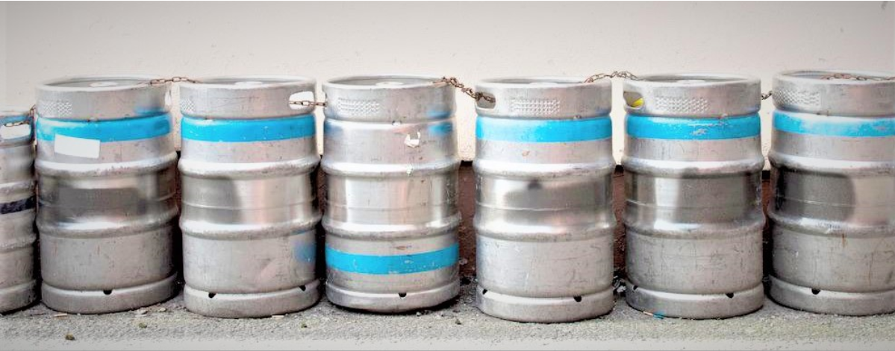

# 基数排序算法分析



>**基数排序**（radix sort）属于“分配式排序”（distribution sort），又称“**桶子法**”（bucket sort）或bin sort，顾名思义，它是透过键值的部份资讯，**将要排序的元素分配至某些“桶”中**，藉以达到排序的作用，基数排序法是属于稳定性的排序，其时间复杂度为O (nlog(r)m)，其中r为所采取的基数，而m为堆数，在某些时候，基数排序法的效率高于其它的稳定性排序法。

**简单地说**，基数排序就是将整数按位数切割成不同的数字，然后按每个位数分别进行比较。	

**具体的做法**就是将所有待比较数值统一为同样的数位长度，数位较短的数前面补零，然后，从最低位开始，依次进行一次排序。这样从最低位排序一直到最高为排序完成以后，数列就变成一个有序序列。


以下我们**通过实例来分析基数排序的算法过程**：

#### 对数组{65， 873， 7， 90， 12， 77， 102， 44}进行基数排序：

##### 第一轮对个位数进行排序：

| 第一轮   |    |  
| :--------: | :--------:| 
| 0  |  90 |  
| 1  |   | 
| 2  |   12、102| 
| 3  |  873 | 
| 4  |   44| 
| 5  |   65| 
| 6  |   | 
| 7  |   7、77| 
| 8  |   | 
| 9  |   | 

##### 第一轮排序之后序列变为{90，12，102，873，44，65，7，77}

##### 第二轮对十位数进行排序：
| 第二轮 |    |  
| :--------: | :--------:| 
| 0  |   102、07|  
| 1  |   12| 
| 2  |   | 
| 3  |   | 
| 4  |   44| 
| 5  |   | 
| 6  |   65| 
| 7  |  873、77| 
| 8  |   | 
| 9  |   90| 

##### 第二轮排序之后序列变为{102，7，12，44，65，873，77，90}

##### 第三轮对百位数进行排序：
| 第三轮 |    |  
| :--------: | :--------:| 
| 0  |   7、12、44、65、77、90|  
| 1  |   102| 
| 2  |   | 
| 3  |   | 
| 4  |   | 
| 5  |   | 
| 6  |   | 
| 7  |  | 
| 8  |   873| 
| 9  |   | 

##### 第三轮排序之后序列变为{7，12，44，65，77，90，102，873}

#### 三轮排序后，我们可以看到之前的无序序列现在已经变成有序序列！

接下来，我们再从宏观角度观察基数排序对该数列进行操作的全程来更好理解基数排序的原理：

|初始状态| 补零      |     第一轮 |   第二轮   |第三轮|最终状态|
|:-----:| :--------: | :--------:| :------: |:------:|:----:|
|65|   065  |  09**0** |  1**0**2  |**0**07|7|
|873|    873|    01**2**|    0**0**7|**0**12|12|
|7|   007  |    10**2**|   0**1**2 |**0**44|44|
|90|    090 |   87**3** |    0**4**4|**0**65|65|
|12|    012 |    04**4**|   0**6**5 |**0**77|77|
|77|    077 |   06**5** |   8**7**3 |**0**90|90|
|102|    102 |   00**7** |    0**7**7|**1**02|102|
|44|    044 |   07**7** |    0**9**0|**8**73|873|

#### 通过该实例演示，我相信大家对基数排序有了更好的理解，希望对大家日后编程有所帮助！

##### 附上基数排序c语言代码：
```cpp
//获取数组a中的最大值
//目的：获取要进行几轮排序
int get_max(int a[], int n)//n为数组长度
{
	int i, max;
	max = a[0];
	for(i = 1; i < n; i++)
		if(a[i] > max)
			max = a[i];
	return max;
}

//对数组按照某位数进行排序
void one_Sort(int a[], int n, int exp)//exp用于分别进行个、十、百···等位数排序
{
	int output[n];//存一轮排序后储临时数组
	int i, buckets[10] = {0};
	
	//将数据出现的次数存储在buckets[]中
	for(i = 0; i < n; i++)
		buckets[(a[i]/exp)%10]++；
	
	//更改buckets[]数组：为了让更改后buckets[i]的值就是该数据再output[]中的位置
	for(i = 1; i < 10; i++)
		buckets[i] += buckets[i-1];
	
	//将数据存储到临时数组中
	for(i = n-1; i >= 0; i--)
	{
		output[buckets[(a[i]/exp)%10]-1] = a[i];
		buckets[(a[i]/exp)%10]--;//！！！
	}

	//将排序后数组赋给a[]
	for(i = 0; i < n; i++)
		a[i] = output[i];
}

//基数排序
void all_Sort(int a[], int n)
{
	int exp;
	int max = get_max(a, n);
	
	for(exp = 1; max/exp > 0; exp *= 10)
		one_Sort(a, n, exp);
}
```
