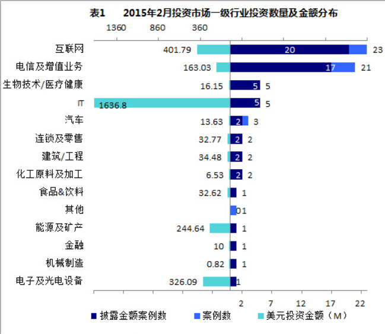
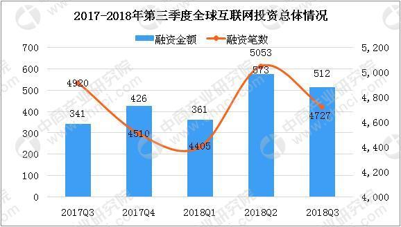
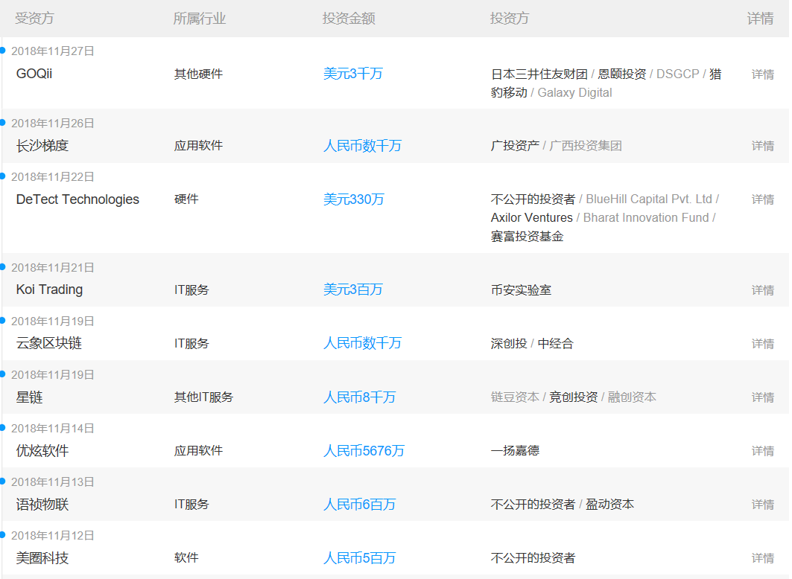
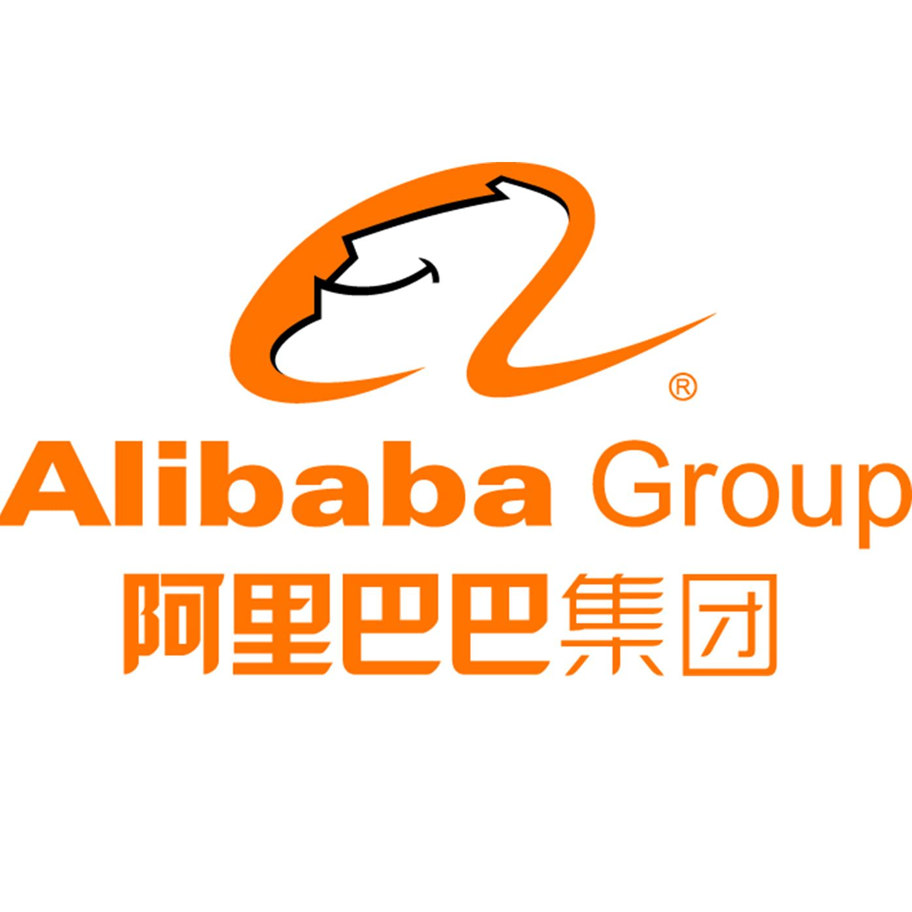
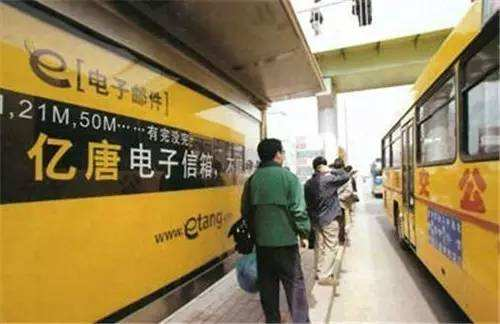

### IT行业之风投

>**维基百科**对于风投的概念解释是这样的：
>风险投资简称风投，又译称为创业投资，主要是指向初创企业提供资金支持并取得该公司股份的一种融资方式。 风险投资是私人股权投资的一种形式。

近年来，it行业的融资量不断上升，且高居各行业之首.

其中，it行业的热门方向人工智能，融资规模增大速度更是超出人们预期。

>**中国报告网**对于**人工智能**产业**风投情况**是这样评价的：
>人工智能也是目前IT行业关注的前沿技术，我国政府于2017年发布了《新一代人工智能发展规划》，确定了人工智能的战略地位，预计2020年我国人工智能行业规模将达到约700亿人民币。百度、阿里、腾讯、科大讯飞成为第一批入选国家AI开放创新平台的企业，更是印证了未来几年我国最尖锐的IT力量将投入人工智能研发的趋势。据IT橘子提供的数据，2016年，我国人工智能领域的投融资达到了26亿美元，位列全球第二位。根据领英提供的数据，我国人工智能行业人才缺口已达500万，供求比仅为1:10，可见这一领域的发展速度已大大超出原有预期。

上图可见，这**仅仅**是近十几天来的it行业风投情况的部分数据。

#### 了解了it行业与风投的大致情况后，我们今天把重点放在**中国it行业的风投**上。

首先，风投为什么会出现，简单的说，就是有人想创业，有人有想法，有人有项目想做，但是**缺钱**，这时候就会有手握较多资产的人寻找他们认为有潜力做大的企业对其进行投资、融资，而在中国，有想法的人更多、有资产的人也非常多，自然风投在中国也是十分常见，但是风投，正如其名，**风险**投资，必定是有利有弊，有人**成功**，必有人**失败**，而且风投的火爆市场背后，必定伴随着越来越多**灰色区域**的出现，更多**套路**的产生。接下来，我们对此进行一一探讨。

#### 成功的案例

若谈到一家初创企业通过风投生存下来并不断壮大，则必要提到马云创办**阿里巴巴**。

1999年9月10日马云创办阿里巴巴，此前他已经创业失败3次。当初只有马云和另外17个合伙人东拼西凑来的50万元。2000年资本寒冬来袭，马云连续被42家风投拒绝。阿里生死攸关差点被卖掉。

尽管当初太多人不看好阿里巴巴，却有一个认可阿里巴巴的男人，投资**2000万美元**，保证了阿里有**足够的资金**开展业务，这个男人叫孙正义。

当时**孙正义**仅用了5分钟时间的交谈，就决定向阿里巴巴**投资20亿日元**。在短短的14年时间内，20亿日元变成了5兆日元。由此可见孙正义的远见与胆识。

阿里巴巴先后在香港联交所，纽约证券交易所上市，市值从香港联交所200亿美元到纽交所的1748.28亿美元，成为市值仅次于苹果、谷歌和微软的大型互联网公司。马云和他的创业团队，由此缔造了**中国互联网史**上最大的**奇迹**。

#### 失败的案例：
从阿里的成功过程可以看到风投对于一家初创的没有太多资金的企业的重要性，但是阿里的成功并不能代表企业只要得到风投就能成功，反而，更多的情况是风投过后仍失败。

典型的例子有**亿唐网**：

1999年，第一次互联网泡沫破灭的前夕，刚刚获得哈佛商学院MBA的唐海松创建了亿唐公司，其"梦幻团队"由5个哈佛MBA和两个芝加哥大学MBA组成。

凭借诱人的创业方案，亿唐从两家著名美国风险投资DFJ、SevinRosen手中拿到两期共5000万美元左右的融资。

亿唐网一夜之间横空出世、迅速在各大高校攻城略地，在全国范围快速"烧钱"：除了在北京、广州、深圳三地建立分公司外，亿唐还广招人手，并在各地进行规模浩大的宣传造势活动。2000年年底，互联网的寒冬突如其来，亿唐钱烧光了大半，仍然无法盈利。此后的转型也一直没有取得成功，2008年亿唐公司只剩下空壳，昔日的"梦幻团队"在公司烧光钱后也纷纷选择出走。

**为什么失败**了？没有定位！浮夸，不愿意沉下心帮用户解决实际的问题，而是幻想凭钱就可以砸出一个互联网集团出来。

#### 灰色区域：

既然风投这么火爆，就伴随着一系列相关行业的产生，风投对接中介就是其中之一。

谈到中介，很多人第一感觉都会想到黑中介，风投领域也没排除在外，风投中介这条产业链上有着许多套路、有着许多灰色领域、有着许多坑。

>有的中介网站，只要你在上面投个计划书之类的，就有人电话跟进了：
>第一天先是跟你了解项目情况，确定融资事实。
>过两天说你的计划书通过专业的评审专家多维度的评审后审核通过，有很大概率能融到资金。
>接着和你谈服务流程，要**先交15800的辅导费**，一条龙服务后，再帮你对接风投。

这大概是最“本真”的骗局了。

>还有一些更为“聪明”培训机构，收取一定费用，承诺教会你吸引风投，教会你在投资人面前路演，教会你······

在教程中，你似乎学得由头有道、有模有样，似乎得到风投就那么简单，但殊不知，课程中、培训中，身边的投资人，身边的评判专家，身边的评分专家，可能都是机构请来的托，给你演了一场戏，骗来你的培训费。

#### 总的来说：
1. 中国it行业的发展速度一定会越来越快，初生互联网公司也将越来越多，风投现象将更加普遍，但新生公司的侧重点应该是在公司的整体规划与发展计划中，而不仅仅是如何取得风投，如果没有规划没有定位，即使取得风投，也终将失败。
2. it行业下的风投行业也会越来越壮大，各种细节仍需要完善，各种灰色地带仍需要照亮，相关行业的发展需要规章制度与法律法规来规范。
