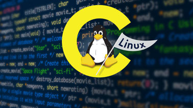
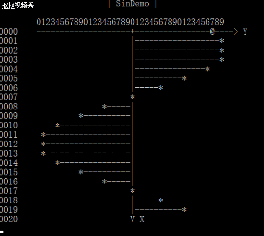
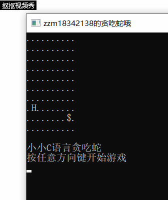
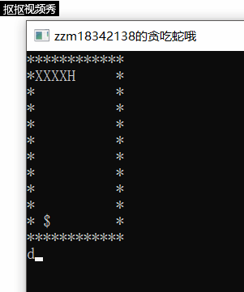
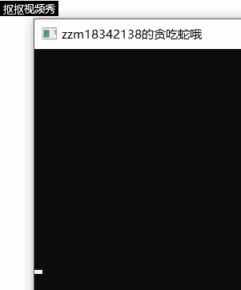

## 智能蛇学习历程记录

上周完成了c语言版的贪吃蛇游戏后，本周我将要学习如何制造出一条会自己寻找食物的智能蛇（通过算法使蛇具有 “感知 - 决策 - 行动” 的能力）。

### 实验目的：
* 了解 算法 与 “智能” 的关系
* 通过算法赋予蛇智能
* 了解 Linux IO 设计的控制



### 学习历程：
**以下将记录在本次作业中，我的学习历程：**

首先，学习**VT 100 终端标准**：

通过作业指导中给到的大佬博客，我知道了如何在字符终端上完成“清屏”“修改光标位置”“设置字符前景和背景色”等操作

[大佬博客——C语言与VT100控制码编程](http://www.cnblogs.com/zengjfgit/p/4373564.html)

>清屏：printf("\033[2J");

>修改光标位置：printf("\033[%d;%dH", x, y);

顺带着，我用大佬的代码演示了一波sin函数的动态变化过程

我们来编译运行它8：
>$ gcc sin-demo.c -osin.out -lm

>$ ./sin.out



看上去有点秀~

接着，学习如何实现**实现 kbhit()**：

参考了老师给的[大佬代码](http://bbs.chinaunix.net/thread-935410-1-1.html)后

我尝试了对我上周的贪吃蛇代码进行了修改（加入了kbhit函数）



当然，这是我在Windows系统下的运行结果(就调用windows库里面的函数就好啦)，如果要在Linux上运行就要手动实现了(把自己的代码插到上面大佬代码中间)

不过我们已经可以看到**kbhit函数**的优点：可以检测键盘有无输入，在用户未输入下一个操作前，运用该函数我们就可以通过判断选择继续执行上一个操作的命令啦

另外，在大佬代码里面还有一个超牛逼的函数，就是**tty_set函数**，这个函数的功能就是可以把终端自带的关闭回显和非阻塞读取打开。（一下子整个程序运行起来就显得更加流畅（看起来）了）

接着，就是本学习历程的重头戏：**学习编写智能算法**：

目标是：编写人工智能程序，使得 snake 每秒自动走一步。（我是要按照规定路线走呢还是直接奔向随机产生的食物的位置呢？）

**思考**：一个长度为5的障碍物能困死该自动跑的蛇吗？

在我看来，答案是肯定的，一个最简单的例子就是把障碍物设置在墙角，当随机食物生成在了墙角处，蛇按照算法就会去找食物，也就自然后进去我们设计的陷阱，就困死了。

以下为智能蛇的部分伪代码：

决定蛇行走的方向函数的伪代码:
>    // Hx,Hy: 头的位置
>     // Fx,Fy：食物的位置
>     function whereGoNext(Hx,Hy,Fx,Fy) {
>     // 用数组movable[4]={“a”,”d”,”w”,”s”} 记录可走的方向
>     // 用数组distance[4]={0,0,0,0} 记录离食物的距离
>     // 分别计算蛇头周边四个位置到食物的距离。H头的位置，F食物位置
>     //     例如：假设输入”a” 则distance[0] = |Fx – (Hx-1)| + |Fy – Hy|
>     //           如果 Hx-1，Hy 位置不是Blank，则 distance[0] = 9999
>     // 选择distance中存最小距离的下标p，注意最小距离不能是9999
>     // 返回 movable[p]
>     }

智能蛇的程序框架:

>输出字符矩阵
>WHILE not 游戏结束 DO
>      wait(time)
> 		ch＝whereGoNext(Hx,Hy,Fx,Fy)
>   	CASE ch DO
>   	‘A’:左前进一步，break 
>   	‘D’:右前进一步，break    
>   	‘W’:上前进一步，break    
>   	‘S’:下前进一步，break    
>   	END CASE
>   	输出字符矩阵
>   END WHILE
>   输出 Game Over!!! 

其实智能蛇与上周写的贪吃蛇的主要差别就是对于蛇的下一步操作ch是根据我们用户输入还是我们预先设定好的算法(whereGoNext)

现在，我们思考如果编写智能蛇搜索食物这一关键函数代码：

第一个想法：**莽夫**思想~~~，我们为什么不可能直接让蛇一行一行或者一列一列地去跑呢，那不就能保证吃到食物且在最高长度范围内不会迟到自己了。（但这样其实有一个弊端：对于行数列数有点特殊的情况，莽着走要么就在最后一行撞墙，要么就漏了一行不能走那样食物产生在那一行我们就莫有办法了）

第二个想法：**智能**~~~，不莽的话我们就要真的去找食物了，搜索的话我们就会想到有很多模式化的算法提供给我们，我们能不能通过比较智能蛇蛇头和食物的坐标位置得出一条路径呢，还是我们能不能利用BFS呢，或者用到贪心呢，不管怎样，最关键的就是不要还没吃到食物就把自己给吃了，所以选取的路径一定是遇到蛇身就绕开，总体方向跑向食物那里。

首先是实现**第一个想法**： 

其实就是给蛇规定了一条路线，在特定的结点帮蛇调整一下方向就可以了

具体关键代码其实就是把上周的代码中的靠人工输入的部分换成一下部分：

```cpp
		if(Snake[0].y == 10)
		{
			Snake[0].now = 3; Move();
			Snake[0].now = 0; Move();
		}
		else if(Snake[0].y == 2 && Snake[0].x != 10 && Snake[0].x != 1)
		{
			Snake[0].now = 3; Move();
			Snake[0].now = 1; Move();
		}
		else if(Snake[0].y == 2 && Snake[0].x == 10)
		{
			Snake[0].now = 0; Move();
			Snake[0].now = 2; Move();
		}
		else if(Snake[0].y == 1 && Snake[0].x == 1)
		{
			Snake[0].now = 1; Move();
		}
		else
		{
			Move();
		}
```



看上去有点蠢， 但是却很无赖~

接着， 思考**第二个想法**：

我们首先对蛇面临的各种情况做一个全面的分析：

一些前提认知：
1. 追着蛇尾跑就不怕吃到身子啦
2. 吃了食物如果等于死亡那还要吃吗

分析情况：
1. 吃得到食物，吃完食物后有路到蛇尾
2. 吃得到食物，吃完食物后没有路到蛇尾
3. 吃不到食物，但有路到蛇尾
4. 吃不到食物，也没路到蛇尾

对于这四种情况，我们给蛇安排一下，对应情况序号我们采取对应措施：
1. 去吃
2. 不去吃，追蛇尾
3. 追蛇尾
4. 无路可走

下面我们考虑用计算蛇头和食物的曼哈顿距离来实现我们的whereGoNext函数算法：

在关键函数whereGoNext中，我们可以先考虑四种情况，就是蛇头分别上下左右走，
通过计算曼哈顿距离，我们最后再筛选出要走最佳路径的时候我们下一步应该走哪个方向。

具体的函数代码就是这样了：（按着老师给的伪代码写就好了）

```cpp
char whereGoNext(int Hx,int Hy,int Fx,int Fy){
    char moveable[4]={'A','D','W','S'};
    int distance[4]={INF,INF,INF,INF};
    int dx[4]={-1,1,0,0},
        dy[4]={0,0,-1,1};
    for(int i=0;i<4;i++){
        int X=Hx+dx[i];
        int Y=Hy+dy[i];
        if (GameMap[Y][X]==' '||GameMap[Y][X]=='$'){
            distance[i]=abs(Fx-(Hx+dx[i]))+abs(Fy-(Hy+dy[i]));
        }
    }
    int k=-1,tmp=INF;
    for(int i=0;i<4;i++){
        if (distance[i]<tmp){
            k=i;
            tmp=distance[i];
        }
    }
    if (k!=-1) return moveable[k];
    else {
        over=0;
        return moveable[0];
    }
}
```

展示一下效果啦：



两个想法的实现总算达到了智能蛇的要求了。

好啦，本周智能蛇的设计学习历程就到这了，在这次的学习中真是获益匪浅。
