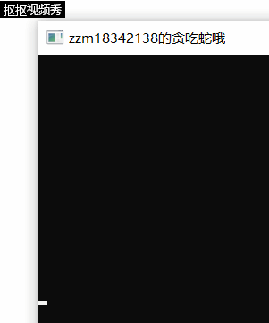

## 字符版本贪吃蛇游戏设计及算法与创新玩法

在这两周里，前后完成了贪吃蛇简单版的c语言版实现和智能蛇的算法实现，在这篇博客里，将介绍一下字符版本贪吃蛇游戏的一些设计及算法实现，外加一些创新玩法

首先，先展示一下简单版的简单版的贪吃蛇c语言代码：

从**设计**上来看

**代码的核心**就是**几个关键的函数**：
1. **void Initial()**;//地图的初始化
2. **void Show()**; //刷新显示地图 
3. **void Move()**; //蛇的移动
4. **void Check_Border()**;//检查蛇头是否越界
5. **void Check_Head(int x, int y)**; //检查蛇头移动后的情况

在main函数中，调用这几个函数，再根据用户输入的字符判断移动方向，就实现了贪吃蛇游戏了

```cpp
#include <stdio.h>
#include <stdlib.h>
#include <time.h>
#include <string.h>
 
#define H 10//地图的高 
#define W 10//地图的宽
#define w 119
#define a 97
#define s 115
#define d 100
int i, j;//循环变量 
int sum = 5;//蛇的长度
int over = 0;//游戏结束标志（自吃或者碰墙）
int dx[4] = {0, 0, -1, 1}; //左右移动
int dy[4] = {-1, 1, 0, 0}; //上下移动

struct Snake{//蛇的每个结点的数据类型 
	int x, y;
	int now;//保存当前结点的方向，0、1、2、3分别为左右上下 
}Snake[H*W];

const char Shead = 'H';
const char Sbody = 'X';
const char Sfood = '$';
const char Snode = ' ';
const char Swall = '*';

void Initial();//地图的初始化
void Show(); //刷新显示地图 
void Move(); //蛇的移动
void Check_Border();//检查蛇头是否越界
void Check_Head(int x, int y); //检查蛇头移动后的情况

char GameMap[H][W];//游戏地图 

int main()
{
	srand(time(NULL)); 
	Initial();
	while(1)
	{
		int ch;
		ch = getchar();
		switch(ch){
			case a: Snake[0].now = 0,Move(); 
					break;				
			case d: Snake[0].now = 1,Move();
					break;
			case w:	Snake[0].now = 2,Move();
					break;
			case s:	Snake[0].now = 3,Move();
					break;
		}	
		if(over)  //自吃或碰墙即游戏结束  
  		{   
   			printf("\n**游戏结束**\n"); 
			printf("你的得分为：%d",sum); 
     		break;  
  		} 
  		system("cls");   //清空地图再显示刷新好的地图 
  		for(i = 0; i < H; i++)   
  		{   
   			for(j = 0; j < W; j++)  
    		printf("%c", GameMap[i][j]);  
   			printf("\n");  
  		}  
	}
	return 0;
 } 

void Initial()
{
	memset(GameMap, ' ', sizeof(GameMap));
	for(i=0; i<W; i++)
	{
		GameMap[0][i] = '*';
		GameMap[H-1][i] = '*';
	}
	for(i=0; i<H; i++)
	{
		GameMap[i][0] = '*';
		GameMap[i][W-1] = '*';
	}
	for(i=1; i<5; i++)
		GameMap[1][i] = 'X';
	GameMap[1][5] = 'H';
	Snake[0].x = 1; Snake[0].y = 5;
	Snake[0].now = -1;
	for(i=1; i<5; i++)
	{
		Snake[i].x = 1;
		Snake[i].y = i;
		Snake[0].now = -1;
	}
	for(i = 0; i < H; i++)
	{
		for(j = 0; j < W; j++)
			printf("%c",GameMap[i][j]);
		printf("\n");
	}
}

void Check_Border()  //检查蛇头是否越界  
{  
 	if(Snake[0].x < 0 || Snake[0].x >= H || Snake[0].y < 0 || Snake[0].y >= W)  
     	over = 1;  
}  

void Check_Head(int x, int y)  //检查蛇头移动后的位置情况  
{      
 	if(GameMap[ Snake[0].x ][ Snake[0].y ] == ' ')  //为空  
  		GameMap[ Snake[0].x ][ Snake[0].y ] = 'H';   
  	else if(GameMap[ Snake[0].x ][ Snake[0].y ] == '$')  //为食物  
  		{  
   			GameMap[ Snake[0].x ][ Snake[0].y ] = 'H';    
   			Snake[sum].x = x;   //新增加的蛇身为蛇头后面的那个  
     		Snake[sum].y = y;  
    		Snake[sum].now = Snake[0].now;  
      	   	GameMap[ Snake[sum].x ][ Snake[sum].y ] = 'X';   
   			sum++;   
  		}  
  	else 
   		over = 1;  
}

void Move()   //蛇的移动  
{  
 	int x, y;  
    int t = sum;  //保存当前蛇的长度  
 	//记录当前蛇头的位置,并设置为空,蛇头先移动  
 	x = Snake[0].x;  y = Snake[0].y;  GameMap[x][y] = ' ';  
 	Snake[0].x = Snake[0].x + dx[ Snake[0].now ];  
 	Snake[0].y = Snake[0].y + dy[ Snake[0].now ];  
 	Check_Border();   //蛇头是否越界  
 	Check_Head(x, y);  //蛇头移动后的位置情况,参数为: 蛇头的开始位置  
	if(sum == t)  //未吃到食物即蛇身移动哦  
		for(i = 1; i < sum; i++)  //要从蛇尾节点向前移动哦,前一个节点作为参照  
	 	{  
	  		if(i == 1)   //尾节点设置为空再移动  
	   			GameMap[ Snake[i].x ][ Snake[i].y ] = ' ';   
	  		if(i == sum-1)  //为蛇头后面的蛇身节点,特殊处理  
	  		{  
	   			Snake[i].x = x;  
	         	Snake[i].y = y;  
	    		Snake[i].now = Snake[0].now;  
	  		}  
	  		else   //其他蛇身即走到前一个蛇身位置  
	  		{  
	   			Snake[i].x = Snake[i+1].x;  
	         	Snake[i].y = Snake[i+1].y;  
	      		Snake[i].now = Snake[i+1].now;  
	  		}	     
	  		GameMap[ Snake[i].x ][ Snake[i].y ] = 'X'; //移动后要置为'X'蛇身   
	 	} 
}  
```


接着我们又思考了如何制造出一条会自己吃东西的智能蛇：

在**设计层面**，我们考虑了两种思想：
1. 单纯地一行一行地无赖地走，扫完地图上的全部空位
2. 通过计算曼哈顿距离，得出最佳路径，直接走向食物

前者的算法实现较为简单，就是规定了蛇在特定结点的方向更改：

```cpp
		if(Snake[0].y == 10)
		{
			Snake[0].now = 3; Move();
			Snake[0].now = 0; Move();
		}
		else if(Snake[0].y == 2 && Snake[0].x != 10 && Snake[0].x != 1)
		{
			Snake[0].now = 3; Move();
			Snake[0].now = 1; Move();
		}
		else if(Snake[0].y == 2 && Snake[0].x == 10)
		{
			Snake[0].now = 0; Move();
			Snake[0].now = 2; Move();
		}
		else if(Snake[0].y == 1 && Snake[0].x == 1)
		{
			Snake[0].now = 1; Move();
		}
		else
		{
			Move();
		}
```


后者的算法实现其实也不算太难，写好伪代码之后，我们的思路就显得十分清晰：

```cpp
// Hx,Hy: 头的位置
// Fx,Fy：食物的位置	
function whereGoNext(Hx,Hy,Fx,Fy) {	
// 用数组movable[4]={“a”,”d”,”w”,”s”} 记录可走的方向
// 用数组distance[4]={0,0,0,0} 记录离食物的距离	
// 分别计算蛇头周边四个位置到食物的距离。H头的位置，F食物位置	
//     例如：假设输入”a” 则distance[0] = |Fx – (Hx-1)| + |Fy – Hy|
//           如果 Hx-1，Hy 位置不是Blank，则 distance[0] = 9999	
// 选择distance中存最小距离的下标p，注意最小距离不能是9999	
// 返回 movable[p]	

char whereGoNext(int Hx,int Hy,int Fx,int Fy){
    char moveable[4]={'A','D','W','S'};
    int distance[4]={INF,INF,INF,INF};
    int dx[4]={-1,1,0,0},
        dy[4]={0,0,-1,1};
    for(int i=0;i<4;i++){
        int X=Hx+dx[i];
        int Y=Hy+dy[i];
        if (GameMap[Y][X]==' '||GameMap[Y][X]=='$'){
            distance[i]=abs(Fx-(Hx+dx[i]))+abs(Fy-(Hy+dy[i]));
        }
    }
    int k=-1,tmp=INF;
    for(int i=0;i<4;i++){
        if (distance[i]<tmp){
            k=i;
            tmp=distance[i];
        }
    }
    if (k!=-1) return moveable[k];
    else {
        over=0;
        return moveable[0];
    }
}		

```



接着， 我们来思考一些**创新玩法**：

**想法一**：

我们能不能给这个游戏设计一个**难度等级**：简单，中档，困难。

这个难度我们还可以是随着游戏的进行而变化，从简单过渡到中档再到苦难。

那么**决定难度的因素**有哪些呢？
1. 食物数量
2. 蛇的移动速度
3. 地图难度

对于**食物数量**来说，我们可以先根据蛇已吃食物的得分来进行变化，例如，当蛇的得分超过某一值时候，我们将地图中的食物数量从1改为2或3等

对于**蛇的移动速度**，有了khbit函数的支持后，我们可以实现蛇在未接受到新的方向命令时候按原方向移动，而移动速度其实取决于我们刷新地图的速度，我们通过**调用_sleep函数我们可以实现循环的短暂休眠**，通过**修改sleep函数里的参数值**我们就可以**实现对蛇移动速度的修改**，这样我们就可以实现随着蛇越来越长，蛇的移动速度越来越快，游戏难度也越来越大。

对于**地图难度**，我们开始的地图是全空的，没有障碍物，随着游戏进行我们可以在地图上突然生成一些特定形状的障碍物（通过手动修改GameMap地图数组）（当然前提是要判断蛇没有占住我们要生成的障碍物的位置。让地形更加复杂，也让游戏难度升级。


**想法二：**

要不要来点人机竞赛？

简单地实现人与电脑的贪吃蛇比赛貌似人的胜率不会太高，因为电脑每走一步都会计算好最短距离


那么我们可以用那些因素来让这场比赛更加公平：

1. 适当减慢电脑智能蛇的移送速度
2. 适当增加人的贪吃蛇吃食物的得分
3. ······

**想法三：**

一个地图里面有多条蛇的游戏：

（其实就是游戏蛇蛇大作战嘛....）

蛇碰到自己或别人的身体，死亡，分解为食物碎片

蛇有突然加速和减速的功能

······

当然还有更多的图形上的变化（超纲啦）

下面po一张蛇蛇大作战的游戏图：


