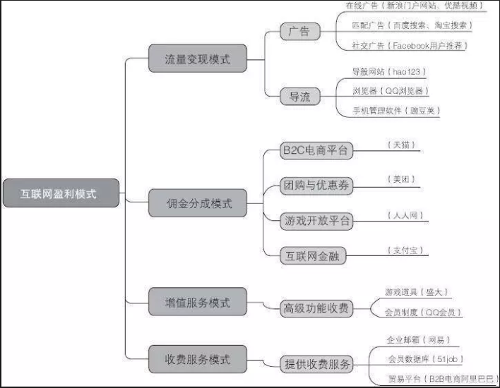
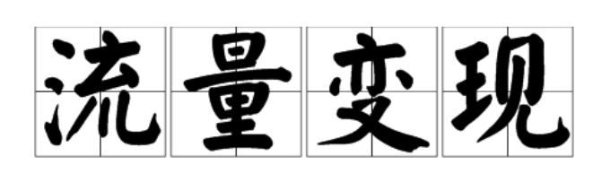
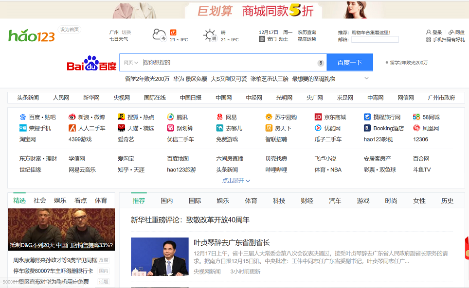

# 互联网时代的盈利模式

互联网内容多种多样，盈利模式也在不断发展、不断创新，其中吴军博士在浪潮之巅中，用了“流量、流量、流量”来强调新经济时代的核心。

本篇博客将围绕“流量”一词谈互联网时代的盈利模式。

从维基百科上我们可以找到今天谈论的主角“流量”也就是“网络流量“的定义：
>网络流量是指能够连接网络的设备在网络上所产生的数据流量。

简单地说，流量贯穿于我们的日常生活，我们**使用手机**的过程就会产生流量，我们**使用微信QQ**等app都会产生流量，而这些流量或被人收集，或使人获益，或消失在大量流量之下。

流量的规模的数量级是庞大的，这也就是为什么他能称为互联网时代盈利模式的核心，也正是为什么吴军会强调**流量是新经济时代的核心**。

那么互联网企业是如何利用流量盈利的呢？

总的来说，流量变现主要有两种方式，一是**广告**，二是**导流**。

其中，广告分为在线广告，匹配广告，社交广告。

在线广告：也就是门户网站的横幅式广告；

匹配广告：互联网的优势在于会与用户进行交互，在交互过程中，产品端可以更好了解用户，从而产生搜索匹配式广告。百度、谷歌等搜索引擎的每次点击广告收费，淘宝的搜索推荐都有广告佣金。

社交广告：QQ空间、朋友圈内都有这种广告，这种广告可以被用户评论，从而产生社交因素，用户可能会出于从众心理进行消费。

另外，导流也是一个重要的流量变现方式：

直接导流：像hao123和360网址导航这类导航页网站就是一类直接将流量导入其他网站的网站，其盈利模式非常简单，就是依靠导流获利。

推荐导流：像安卓应用市场这类软件或网站，通过向用户推荐软件实现导流。

细致分析：

”流量-广告“模式：

广告模式有两种个形态，一种是“内容-流量”形态，也就是通过精彩的内容，吸引流量，以此作为做广告的基础；另一种是“搜索引擎”形态，代表企业就是谷歌。（有人曾经嘲笑谷歌，认为“谷歌就是个卖广告的”。这句话道出了互联网最基本的盈利模式——“流量-广告”模式。）

早期的互联网企业，其盈利基本都来自于“流量-广告”模式。这个模式是从盈利的角度说，是典型的“交叉补贴”。就是提供服务和产品的一方，并不像使用者收取任何费用，其收益来源由第三方。使用者在使用服务的时候，如果点击了广告，则投放广告的企业负责付款。

”流量-导流“模式：

我们经常会想：为何当今做导航网站会这么多人,靠什么赚钱,怎么盈利？

其实像hao123这类网站的盈利方式也是十分的简单，就是**靠流量赚钱**：

广告，有了流量，给别的商家做广告依然是最好的盈利模式;再有，就是在站上放搜索引擎搜索框，然后从搜索引擎上拿提成，当然这得建立在流量大的基础上，可以按时间计费，比如，一年多少钱，还可以，按搜索量计费，一般搜索引擎提供商利用某些技术能统计这些数据。

归根结底，大部分网站，他们的盈利模式除了广告，还是广告，那广告怎么吸引呢，除了流量，还是流量。这也就是为什么流量在新经济时代的盈利模式下显得如此重要。
