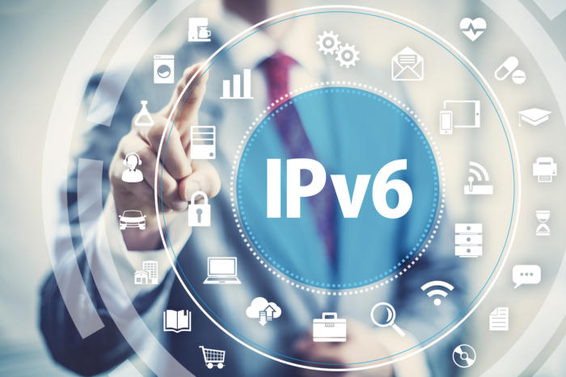
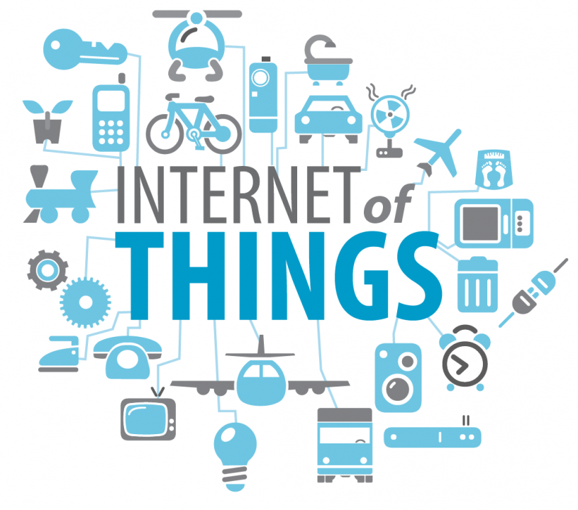
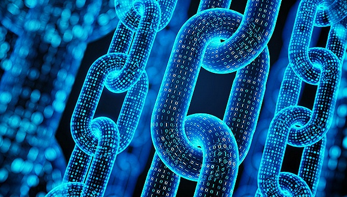
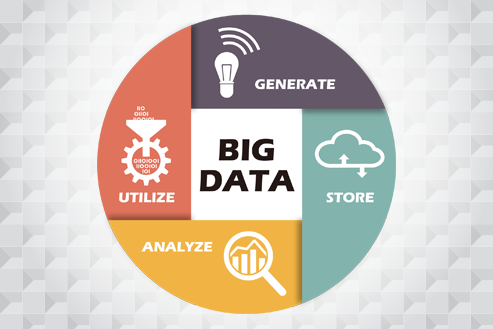
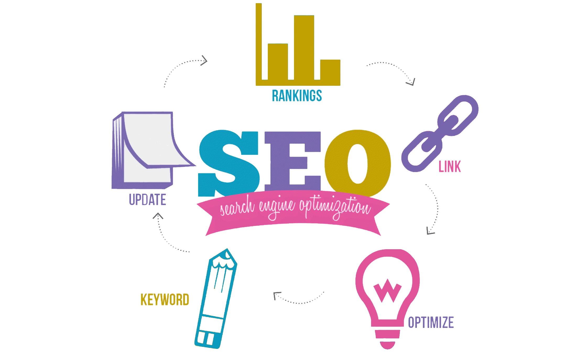
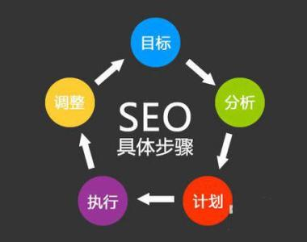
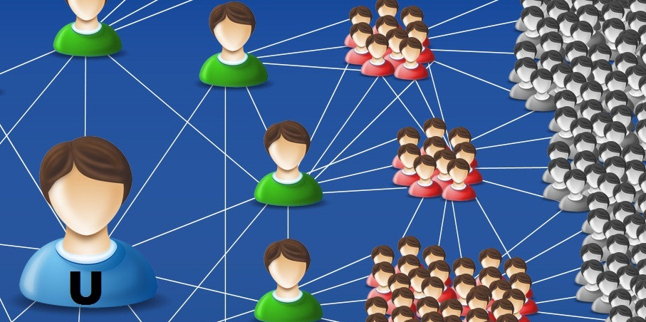
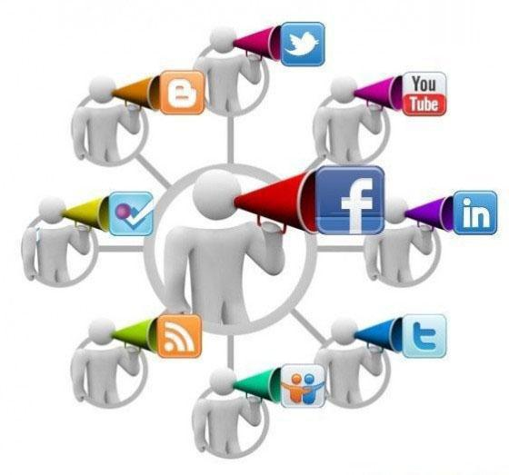

# 互联网时代的热点领域选择、营销方法

>本篇博文将介绍互联网时代的热点领域选择、营销方法。

### 首先，我们来谈谈互联网时代的热点领域。

在日新月异的今天，互联网已经成为我们生活不可或缺的工具，那么互联网的热点领域有哪些呢？

### ipv6

>2017年底，国家开始推行IPv6普及，预计2年后达到5亿用户。

>由于IPv4最大的问题在于网络地址资源有限，严重制约了互联网的应用和发展。IPv6的使用，不仅能解决网络地址资源数量的问题，而且也解决了多种接入设备连入互联网的障碍

从90年代到现在，我们使用的都是第四代互联网（IPv4），借助互联网浪潮，特别是进入移动互联网时代，IPv4经历了快速发展。

互联网发展太快了，然而第四代互联网扛不住了，第四代互联网能够容纳的设备是有限的，现在已经接近饱和状态了。

所以，为了容纳更多的设备，给我们带来更大的便利，第六代互联网（IPv6）来了。

IPv6有啥好处？

好处1：可以有更多的设备联网

好处2：可以有更快的速度

好处3：更加安全

### 物联网

>物联网是新一代信息技术的重要组成部分，也是“信息化”时代的重要发展阶段。其英文名称是：“Internet of things（IoT）”。顾名思义，物联网就是物物相连的互联网。这有两层意思：其一，物联网的核心和基础仍然是互联网，是在互联网基础上的延伸和扩展的网络；其二，其用户端延伸和扩展到了任何物品与物品之间，进行信息交换和通信，也就是物物相息。物联网通过智能感知、识别技术与普适计算等通信感知技术，广泛应用于网络的融合中，也因此被称为继计算机、互联网之后世界信息产业发展的第三次浪潮。物联网是互联网的应用拓展，与其说物联网是网络，不如说物联网是业务和应用。因此，应用创新是物联网发展的核心，以用户体验为核心的创新2.0是物联网发展的灵魂。

物联网起源于传媒领域，是信息科学技术产业的第三次革命。物联网是基于互联网、广播电视网、传统电信网等信息承载体，让所有能够被独立寻址的普通物理对象实现互联互通的网络。

在供给侧和需求侧的双重推动下，物联网进入以基础性行业和规模消费为代表的第三次发展浪潮，5G、低功耗广域网等基础设施加速构建，数以万亿计的新设备将接入网络并产生海量数据，人工智能、边缘计算、区块链等新技术加速与物联网结合，应用热点迭起，物联网迎来跨界融合、集成创新和规模化发展的新阶段。

### 区块链

>区块链是分布式数据存储、点对点传输、共识机制、加密算法等计算机技术的新型应用模式。

狭义来讲，区块链是一种按照时间顺序将数据区块以顺序相连的方式组合成的一种链式数据结构， 并以密码学方式保证的不可篡改和不可伪造的分布式账本。

广义来讲，区块链技术是利用块链式数据结构来验证与存储数据、利用分布式节点共识算法来生成和更新数据、利用密码学的方式保证数据传输和访问的安全、利用由自动化脚本代码组成的智能合约来编程和操作数据的一种全新的分布式基础架构与计算方式 。

### 人工智能

>人工智能是计算机科学的一个分支，它企图了解智能的实质，并生产出一种新的能以人类智能相似的方式做出反应的智能机器，该领域的研究包括机器人、语言识别、图像识别、自然语言处理和专家系统等。人工智能从诞生以来，理论和技术日益成熟，应用领域也不断扩大，可以设想，未来人工智能带来的科技产品，将会是人类智慧的“容器”。人工智能可以对人的意识、思维的信息过程的模拟。人工智能不是人的智能，但能像人那样思考、也可能超过人的智能。

人工智能不仅会改造工业和金融行业，还将带来经济关系的改变。基本供求经济学将被重塑，多数产业将由新技术引领。未来的科技发展，人工智能将是主要引擎。

2018 政府工作报告：
" 加强新一代人工智能研发应用 "

报告中，总理提及人工智能以及云计算、物联网等相关领域的发展。

在对 2018 年政府工作的建议中，提到要" 发展壮大新动能。做大做强新兴产业集群，实施大数据发展行动，加强新一代人工智能研发应用，在医疗、养老、教育、文化、体育等多领域推进‘互联网 + ’。发展智能产业，拓展智能生活。运用新技术、新业态、新模式，大力改造提升传统产业 "。
这是 " 人工智能 " 连续第二次被写入政府工作报告中。一方面表明政府对于高新产业的重视；另一方面，也侧面体现了目前人工智能技术的发展速度和对社会对产业带来的影响。
人工智能同样受到了科技界代委员与代表们的关注。包括李彦宏和马化腾在内的许多企业家都带来了与人工智能相关的提案和议案。

### 大数据

>大数据（big data），指无法在一定时间范围内用常规软件工具进行捕捉、管理和处理的数据集合，是需要新处理模式才能具有更强的决策力、洞察发现力和流程优化能力的海量、高增长率和多样化的信息资产。

大数据的意义是由人类日益普及的网络行为所伴生的，受到相关部门、企业采集的，蕴含数据生产者真实意图、喜好的，非传统结构和意义的数据 。

从海量数据中提纯出有用的信息，这对网络架构和数据处理能力而言也是巨大的挑战。在经历了几年的批判、质疑、讨论、炒作之后，大数据终于迎来了属于它的时代。

大数据时代已经来临，它将在众多领域掀起变革的巨浪。但我们要冷静的看到，大数据的核心在于为客户挖掘数据中蕴藏的价值，而不是软硬件的堆砌。

在以云计算为代表的技术创新大幕的衬托下，这些原本很难收集和使用的数据开始容易被利用起来了，通过各行各业的不断创新，大数据会逐步为人类创造更多的价值。

### 接下里，我们来看看互联网时代的营销方法有哪些？

### 搜索引擎营销

>搜索引擎营销就是根据用户使用搜索引擎的方式利用用户检索信息的机会尽可能将营销信息传递给目标用户。简单来说，搜索引擎营销就是基于搜索引擎平台的网络营销，利用人们对搜索引擎的依赖和使用习惯，在人们检索信息的时候将信息传递给目标用户。搜索引擎营销的基本思想是让用户发现信息，并通过点击进入网页，进一步了解所需要的信息。企业通过搜索引擎付费推广，让用户可以直接与公司客服进行交流、了解，实现交易。

基本过程:

1、企业信息发布在网站上成为以网页形式存在的信息源（包括企业内部信息源及外部信息源）；

2、搜索引擎将网站/网页信息收录到索引数据库；

3、用户利用关键词进行检索（对于分类目录则是逐级目录查询）；

4、检索结果中罗列相关的索引信息及其链接URL；

5、根据用户对检索结果的判断选择有兴趣的信息并点击URL进入信息源所在网页；

6、搜索关键词；

7、看到搜索结果；

8、点击链接；

9、浏览企业网站；

10、实现转化。

###  数据库营销

>数据库营销是为了实现接洽、交易和建立客户关系等目标而建立、维护和利用顾客数据与其他顾客资料的过程。

>通过收集和积累消费者大量的信息，经过处理后预测消费者有多大可能去购买某种产品，以及利用这些信息给产品以精确定位，有针对性地制作营销信息达到说服消费者去购买产品地目的。通过数据库的建立和分析，各个部门都对顾客的资料有详细全面的了解，可以给予顾客更加个性化的服务支持和营销设计，使 " 一对一的顾客关系管理 " 成为可能。 

数据库营销是惟一一种可测度的营销形式，你能够准确地知道如何获得客户的反应以及这些反应来自何处。相较于传统的营销方式，数据库营销的好处在于沟通渠道多样化、成本最小化，效果最大化、始终具备可测性。

### 病毒式营销

>病毒营销是利用公众的积极性和人际网络，让营销信息像病毒一样传播和扩散，营销信息被快速复制传向数以万计、数以百万计的观众，它能够像病毒一样深入人脑，快速复制，迅速传播，将信息短时间内传向更多的受众。

病毒式营销是由信息源开始，再依靠用户自发的口碑宣传，达到一种快速滚雪球式的传播效果。它描述的是一种信息传递战略，经济学上称之为病毒式营销，因为这种战略像病毒一样，利用快速复制的方式将信息传向数以千计，数以百计的受众。

### 问答营销

>问答营销属于互动营销新型营销方式，是互动营销介于第三方口碑而创建的网络营销方式之一，营销方式既能与潜在消费者产生互动，又能植入商家广告，是做品牌口碑、互动营销不错的营销方式之一。遵守问答站点（百度，天涯等）的发问或回答规则。然后巧妙地运用软文，让自己的产品、服务植入问答里面，达到第三方口碑效应。

特点：

互动性：
问答类的互动效果可以充分的补充我们网站内容的不足，也能让读者完善知识面，这样的互动效果不仅起到了针对性效果，又能起到广泛性的效果。

针对性：
问答可以针对某个目标群体，根据群体的特点选择关注的焦点，充分调动这个人群的力量，达到具有针对的效果。也可以针对话题做讨论，让更多的人来参与，达到人群融合的效果。

广泛性：
问答营销的特点本身就决定了问答营销的广泛性，一个问题，可以引来不同人群的讨论，一个事件可以引来不同人群来评论，品牌的建议往往从问答开始。

媒介性：
我们可以通过文章或者问题的形式在各大平台或者媒体来投稿，只要稿件通过或者是问题通过，那么借助媒介可以达到更好的效果，比如您是做发电机的，可以把发电机的技术指标到相关的论坛发布，那里会有很多高级的工程师，他们的评论和回答是可以从中借鉴。

可控制性：
如果您是做平台或者是做媒介的，评论可以通过审核的方式来控制，去除重复的，不符合规定的评论，从而达到让读者有益，让内容健康的效果。

### 博客营销

>博客营销是通过博客网站或博客论坛接触博客作者和浏览者，利用博客作者个人的知识、兴趣和生活体验等传播商品信息的营销活动。

博客这种网络日记的内容通常是公开的，自己可以发表自己的网络日记，也可以阅读别人的网络日记，因此博客可以理解为一种个人思想、观点、知识等在互联网上的共享。

优势：

1、细分程度高，广告定向准确
 
2、互动传播性强，信任程度高，口碑效应好

3、影响力大，引导网络舆论潮流

4、大大降低传播成本

