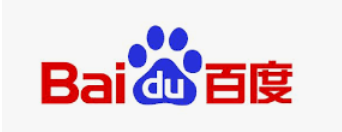

## 社会热点专题探讨——风险投资知识与其利弊

| 姓名      |    学号| 
| :--------: | :--------:| 
| 郑卓民    |   18342138| 

### 风险投资相关知识：

**风险投资**简称**风投**，又译称为**创业投资**，是一种**私募股权**，一种**融资形式**，由公司或基金提供给被认为具有高增长潜力或已经表现出高增长的小型早期新兴公司。

总体来看，在递进投资方式中有六轮投资，分别是**天使轮**，**A轮**，**B轮**，**C轮**，**D轮**，**上市IPO**。在层层递进过程中，会不断排除特定创业风险，尽早淘汰不合格项目。

那么**天使投资人**到底投资的是什么？是**想法**！那他们看重什么？

**三件事：**

1.**市场容量！**

 >市场容量是指在不考虑产品价格或供应商的前提下，市场在一定时期内能够吸纳某种产品或劳务的单位数目。若有市场容量，可以自然拉动企业投资和经济发展; 没有市场容量，仅仅依靠企业效宏来推动经济增量，就蕴藏着经济失调的巨大风险。
 
举个例子：手机的市场容量比空调市场大。

可以说：**在投资人的眼里，市场容量决定了想法的高度！**

2.**创始团队！**

投资人看重创始团队应该不难理解，一个团队的学历，一个团队的能力（之前取得的成就）等等都影响着投资人对该团队想法的判断。

换句话说，**在投资人的眼里，创始团队决定了想法达成的可能性！**

3.**投资热度！**

投资热度直接影响该想法/项目方向的企业多与否，竞争激烈与否，过热的想法或过冷的想法都有着大风险，投资人会在这当中寻找平衡点，只有符合投资人心中平衡程度的想法，才大概率能拿到风投。

一句话，**在投资人的眼里，投资热度决定了资本竞争的强度！**

**此外**，风险投资之所以被称为风险投资，是因为在风险投资中有**很多的不确定性**，给投资及其回报带来**很大的风险**。一般来说，风险投资都是投资于拥有高新技术的初创企业，这些企业的创始人都具有很出色的技术专长，但是在公司管理上缺乏经验。另外一点就是一种新技术能否在短期内转化为实际产品并为市场所接受，这也是不确定的。同时，**风险投资家**既是**投资者**又是**经营者**。风险投资家一般都有很强的技术背景，同时他们也拥有专业的经营管理知识，这样的知识背景帮助他们能够很好的理解高科技企业的商业模式，并且能够**帮助创业者改善企业的经营和管理**。

**既然**风投的风险这么大，**为什么**还会有人愿意拿出大批资金出来进行风投？**回报大！**

以**阿里巴巴**为例：

>1999年9月10日马云创办阿里巴巴，此前他已经创业失败3次。当初只有马云和另外17个合伙人东拼西凑来的50万元。2000年资本寒冬来袭，马云连续被42家风投拒绝。阿里生死攸关差点被卖掉。
>尽管当初太多人不看好阿里巴巴，却有一个认可阿里巴巴的男人，投资**2000万美元**，保证了阿里有足够的资金开展业务，这个男人叫**孙正义**。
>当时孙正义仅用了5分钟时间的交谈，就决定向阿里巴巴投资**20亿日元**。在短短的14年时间内，**20亿日元**变成了**5兆日元**。
>阿里巴巴先后在香港联交所，纽约证券交易所上市，市值从香港联交所**200亿美元**到纽交所的**1748.28亿美元**，成为市值仅次于苹果、谷歌和微软的大型互联网公司。马云和他的创业团队，由此缔造了中国互联网史上最大的奇迹。

可以说一次成功的风投可以给投资人带来**巨大资金回报**，当然这也取决于**投资人的远见和胆识**。

### 风险投资的利弊：

风险投资是一个涉及创始团队和投资人双方的项目，由于双方的立场不同，双方看待某些问题的想法就有可能有矛盾，自然就产生了相应的正面效应或负面效应，下面我们就来谈谈风险投资的利弊：

1. 一家企业接受了风投之后，将得到大量资金，公司的日常运作、项目的开展等方面都**少了很多资金上的束缚**，这点是对创始团队及其公司**有利**的，但是另一方面，接受了风投也意味着交易了股权，部分**股权**给到了投资人，创始团队对公司的控制权将有所减少，未来企业的壮大或者衰败都可能出现股权的一些纷争，这点看来是对创始团队**有弊**的。

2. 一家企业接受了风投之后，天使投资人将有可能参与到公司的日常运作指导中，一位有强大技术与管理背景的天使投资人可能会给公司的管理与发展带来**变革**，让公司更加有活力，这是**有利**的，但是另一方面，投资人选择投资一个想法，一定是希望能够得到回报的，如果该创业公司在业绩上并没有达到预期的标准，甚至给不到投资人想要的最低回报，达不到投资人的预期，那么**投资人和创始团队就有可能产生矛盾**，这家企业的发展可能就会陷入难关，这是**有弊**的。

其实**总的来说**，风险投资的利弊都是围绕**资金投入与回报**、**创始团队与投资人各自看法**、**股权的分配**。

**但是**，综合来讲，**风投的利仍然是大于弊的**，风投的这一笔资金，可以救一个企业于水深火热之中，可以让新生公司实现新想法走向成功；在合理的管理与规划下，投资人得到回报的概率也是比较大的。

### 一些成功的风投案例：

>中国大陆企业在海外股市（新加坡、纳斯达克）上市的互联网企业都曾获得过风险投资的支持，比如说**腾讯的马化腾**、**百度的李彦宏**、**盛大的陈天桥**和**搜狐的张朝阳**都曾获得美国风险投资公司的资金支持。

#### 腾讯：
1. 当年马化腾创业突见成效的时候，急需资金购买服务器和为员工开支，当时准备寻找国外风险投资，IDG和盈科数码以各占腾讯20%股份的代价向腾讯投资了220万美元。马化腾及其团队持股60%。正是这220万美元的风险资金，为腾讯日后的迅速掘起奠定了基础。那是1999-2000年左右。
2. 2001年6月，香港盈科以1260万美元的价格将其所持腾讯控股20%的股权悉数出售给MIH，米拉德国际控股集团公司 ，以110万美元的投资，在不到一年中即获得1000余万美元的回报已经堪称奇迹，但事实证明盈科还是低估了腾讯的成长潜力。 
······

#### 百度：
1. 2000年2月，Integrity Partners和Peninsula Capital Fund两家VC联手向百度投资，总投资额为120万美元。此次融资是百度起航的第一批燃油，百度运用这批融资开始制作自己的搜索引擎与初期投入。此时，百度处于创业的初期。
2. 2000年9月，第一轮投资者Integrity Partners和Peninsula Capital方兴未艾，拉上美国三大风险投资商之一的DFJ以及IDG入伙，融资额为1000万美元。
3. 2004年6月，Google及DFJ等八家风险投资机构共投资1500万美元.
4. 2005年8月5日，百度成功登陆美国纳斯达克，创造了中国概念股的美国神话，开启全球互联网的“中国时代”。 

### 一点心得：
一次成功的风投和投资人与创始团队都密切相关：
- 对于天使投资人而言，风险投资具有高风险与高回报的特性，这一过程正考验他们的眼界与见识以及一个创意想法/项目发展前景的判断，同时，还有投资人对于创始团队与公司在技术或者管理上的影响，这些都直接影响最终能否取得相应的效益。
- 对于创始团队而言：
 1. **人！团队！**每个人要将个人能力发挥到极致，做好力所能及的事情；团队成员间遇到分歧，想办法解决而不是制造矛盾；股权分配要制定好规则，做到公平公正；对艰难的工作保持激情······
 2. **使命！**目光不能短浅，要有远大的使命，对未来要有清晰的规划，有明确的目标······
 3. **节点！**创业过程举步维艰，众多艰难节点需要团队众志成城才能跨越，而只有一次一次度过每一个节点，稳打稳扎得做好每一个细节，一个公司才会走向成功。
 4. **风口！**机会是平等的，同时也是瞬间的，如何快速地捕捉到机会，如何做出最快地反应，将影响着一个新生公司的发展进程。

